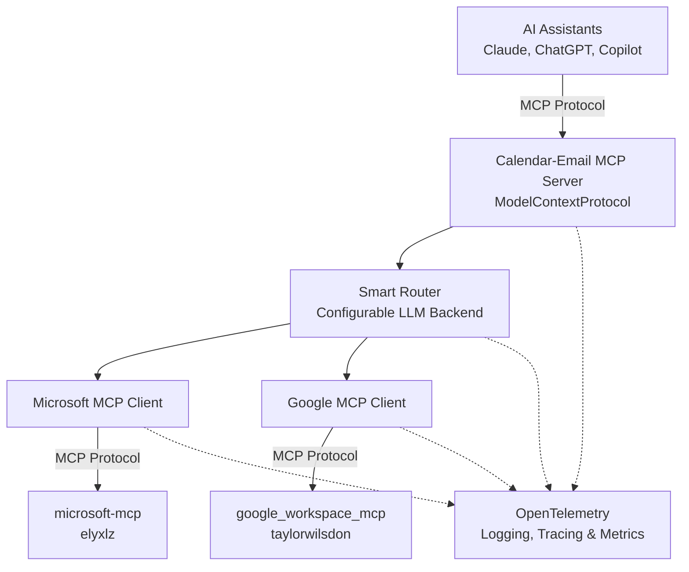

# Calendar & Email MCP - Design Specification

## Project Overview

An MCP (Model Context Protocol) server that provides a unified read and query interface for multiple email and calendar accounts across Microsoft 365 (multiple tenants), Outlook.com, and Google Workspace. This enables AI assistants (Claude Desktop, ChatGPT, GitHub Copilot, etc.) to access all your accounts simultaneously for tasks like summarizing emails across all inboxes, viewing consolidated calendar schedules, and finding available meeting times across all calendars.

## Problem Statement

Professionals working with multiple organizations often manage:
- Multiple M365 tenants (different work accounts)
- Personal Outlook.com accounts
- Google Workspace accounts
- Need unified AI-powered management across all accounts

Currently, no AI assistant (Claude, ChatGPT, Copilot) can access all these services simultaneously in a multi-tenant scenario.

## Solution Architecture

### High-Level Architecture



### Core Components

#### 1. MCP Server Interface (ModelContextProtocol Package)
- **Exposes MCP tools** to AI assistants for unified email/calendar queries
- **Core Tools**:
  - `get_unread_emails` - Get all unread emails across all accounts
  - `search_emails` - Search emails across all accounts with filters
  - `get_email_details` - Get full email content from specific account
  - `list_calendars` - List all calendars from all accounts
  - `get_calendar_events` - Get events for date range across all calendars
  - `find_available_times` - Find free time slots across all calendars
  - `send_email` - Send email from appropriate account (requires routing)
  - `create_event` - Create calendar event in appropriate calendar (requires routing)
- **Transport**: Supports stdio, SSE, and WebSocket transports
- **Configuration**: Account setup and router configuration via MCP resources

#### 2. Account Registry
- Configuration-based mapping of accounts to contexts
- Supports multiple M365 tenants, Outlook.com, and Google Workspace
- Account metadata (display name, domain patterns, priority)
- Credential management integration

#### 3. Smart Router
- **Configurable AI Backend** - Key Design Principle
- Uses LLM to intelligently route requests to appropriate accounts
- Supports multiple backend options:
  - Local models via Ollama (Phi-3.5-mini, Qwen2-7B, etc.)
  - Cloud APIs (OpenAI, Anthropic, Azure OpenAI)
  - Custom model endpoints
- Classification based on:
  - Email domain patterns
  - Content keywords and context
  - User preferences and history
  - Explicit user directives

#### 4. MCP Client Managers
- **Microsoft MCP Client**: Interfaces with microsoft-mcp server
  - Supports multiple M365 tenant connections
  - Outlook.com account support
  - Email, calendar, contacts, OneDrive operations
  
- **Google MCP Client**: Interfaces with google_workspace_mcp server
  - Gmail operations
  - Google Calendar management
  - Drive access
  - Multi-account OAuth support

#### 5. Workflow Engine
- Aggregates data from multiple accounts
- Examples:
  - "Summarize all my unread emails from the last 24 hours"
  - "Show me my calendar for tomorrow across all accounts"
  - "Find 1-hour slots next week where I'm free across all calendars"
  - "What emails do I have about the Acme project?"
- Orchestrates multiple MCP server calls in parallel
- Merges and deduplicates results from different sources

#### 6. OpenTelemetry Integration
- **Structured Logging**: Consistent log formatting across all components
- **Distributed Tracing**: End-to-end request tracking across MCP servers
- **Metrics Collection**: Performance monitoring and usage analytics
- **Exporters**: Support for multiple backends
  - Console (development)
  - OTLP (OpenTelemetry Protocol)
  - Jaeger (distributed tracing)
  - Prometheus (metrics)
  - Azure Monitor / Application Insights
- **Key Telemetry**:
  - Router decision latency and accuracy
  - MCP server response times
  - Authentication success/failure rates
  - API call volumes per account
  - Error rates and exception tracking

## Existing MCP Servers to Leverage

### Microsoft Ecosystem
1. **microsoft-mcp** (elyxlz)
   - Most comprehensive M365 integration
   - Multi-account support
   - Email, calendar, OneDrive, contacts

2. **ms-365-mcp-server** (Softeria)
   - Full M365 suite support
   - Organization mode for work accounts

3. **office-365-mcp-server** (hvkshetry)
   - 24 consolidated tools
   - Headless operation
   - Automatic token refresh

### Google Ecosystem
1. **google_workspace_mcp** (taylorwilsdon)
   - Most feature-complete
   - Natural language control
   - Multi-user OAuth 2.1
   - Gmail, Calendar, Drive, Docs, Sheets

2. **google-workspace-mcp** (aaronsb)
   - Authenticated access to Gmail, Calendar, Drive, Contacts
   - Multi-account support

## Configuration Design

### Model Configuration
The router's AI backend should be fully configurable to allow users to choose based on their preferences and resources:

```json
{
  "router": {
    "backend": "ollama|openai|anthropic|azure|custom",
    "model": {
      "ollama": {
        "model": "phi3.5:3.8b",
        "endpoint": "http://localhost:11434"
      },
      "openai": {
        "model": "gpt-4o-mini",
        "apiKey": "${OPENAI_API_KEY}"
      },
      "anthropic": {
        "model": "claude-sonnet-4-20250514",
        "apiKey": "${ANTHROPIC_API_KEY}"
      },
      "azure": {
        "model": "gpt-4o-mini",
        "endpoint": "${AZURE_ENDPOINT}",
        "apiKey": "${AZURE_API_KEY}"
      },
      "custom": {
        "endpoint": "https://custom-endpoint.com/v1/chat",
        "model": "custom-model-name",
        "apiKey": "${CUSTOM_API_KEY}"
      }
    },
    "temperature": 0.3,
    "maxTokens": 500
  }
}
```

### OpenTelemetry Configuration

```json
{
  "telemetry": {
    "serviceName": "calendar-email-mcp",
    "serviceVersion": "1.0.0",
    "logging": {
      "level": "Information",
      "console": true,
      "structured": true
    },
    "tracing": {
      "enabled": true,
      "samplingRatio": 1.0,
      "exporters": ["console", "otlp"]
    },
    "metrics": {
      "enabled": true,
      "intervalSeconds": 60,
      "exporters": ["console", "prometheus"]
    },
    "exporters": {
      "otlp": {
        "endpoint": "http://localhost:4317",
        "protocol": "grpc"
      },
      "jaeger": {
        "endpoint": "http://localhost:14268/api/traces"
      },
      "prometheus": {
        "port": 9090,
        "endpoint": "/metrics"
      },
      "azureMonitor": {
        "connectionString": "${APPLICATIONINSIGHTS_CONNECTION_STRING}"
      }
    }
  }
}
```

### Account Configuration

```json
{
  "accounts": [
    {
      "id": "xebia-work",
      "type": "microsoft365",
      "displayName": "Xebia Work",
      "tenantId": "...",
      "priority": 1,
      "domains": ["xebia.com"],
      "keywords": ["xebia", "work project"],
      "isDefault": false
    },
    {
      "id": "marimer-work",
      "type": "microsoft365",
      "displayName": "Marimer M365",
      "tenantId": "...",
      "priority": 2,
      "domains": ["marimer.com"],
      "keywords": ["marimer", "client"],
      "isDefault": false
    },
    {
      "id": "marimer-gsuite",
      "type": "google",
      "displayName": "Marimer G-Suite",
      "priority": 3,
      "domains": ["marimer.com"],
      "keywords": ["marimer", "personal"],
      "isDefault": false
    },
    {
      "id": "personal-outlook",
      "type": "outlook",
      "displayName": "Personal Outlook",
      "priority": 4,
      "domains": ["outlook.com", "hotmail.com"],
      "keywords": ["personal", "family"],
      "isDefault": true
    }
  ]
}
```

## Recommended Local Models

For users choosing local Ollama models, recommended options:

### Phi-3.5-mini (3.8B) - Recommended Default
- Excellent classification accuracy
- 128K context length
- ~2.4GB quantized
- Fast inference (12+ tokens/sec on modest hardware)
- Strong reasoning capabilities

### Qwen2-7B
- Excellent structured data understanding
- Strong logic-based routing
- Good for complex decision-making

### Qwen2-1.5B
- Ultra-lightweight
- Blazing fast routing
- Good for simpler classification tasks
- Minimal resource usage

## Key Features

### Phase 1 - Core Functionality
1. Multi-account authentication and management
2. Read-only email queries (unread, search, details)
3. Read-only calendar queries (events, availability)
4. Unified view aggregation across all accounts
5. OpenTelemetry instrumentation for observability

### Phase 2 - Write Operations
1. Send email from appropriate account (with smart routing)
2. Create calendar events in appropriate calendar (with smart routing)
3. Email threading and conversation tracking
4. Advanced search with filters and date ranges

### Phase 3 - AI-Assisted Scheduling
1. Intelligent meeting time suggestions across calendars
2. Automated meeting coordination via email
   - Find times that work for you
   - Email participants to find times that work for them
   - Propose optimal meeting times
3. Conflict detection and resolution
4. Meeting preparation summaries

## Technical Stack

- **Language**: C# / .NET 10
- **MCP Server Framework**: ModelContextProtocol NuGet package
- **MCP Client Integration**: Consumes existing Microsoft and Google MCP servers
  - **Microsoft**: @softeria/ms-365-mcp-server (npm) - Primary choice
    - 90+ tools, org mode, OAuth support
    - Alternative: hvkshetry/office-365-mcp-server or elyxlz/microsoft-mcp (Python)
  - **Google**: google-workspace-mcp (TBD - to be evaluated in spike)
  - **Outlook.com**: Same as Microsoft, using personal account mode
- **AI Routing**: Configurable (Ollama, OpenAI, Anthropic, Azure, Custom)
- **Configuration**: JSON-based with environment variable support
- **Authentication**: OAuth 2.0 (Microsoft MSAL, Google OAuth)
- **Observability**: OpenTelemetry for logging, tracing, and metrics
  - OpenTelemetry .NET SDK
  - OTLP exporters
  - Instrumentation libraries for HTTP, gRPC, and custom spans

## MCP Server Dependencies

### Microsoft 365 - Evaluated Options

#### @softeria/ms-365-mcp-server ⭐ PRIMARY CHOICE
- **Status**: ✅ Mature, actively maintained (v0.27.1)
- **npm**: `@softeria/ms-365-mcp-server`
- **Repository**: https://github.com/Softeria/ms-365-mcp-server
- **Multi-tenant**: Run multiple instances, one per tenant
- **Features**: 90+ tools, org mode, OAuth/device code/BYOT auth
- **Transport**: stdio (default) or HTTP (`--http <port>`)
- **Installation**: `npm install -g @softeria/ms-365-mcp-server`

#### hvkshetry/office-365-mcp-server - Alternative
- **Status**: ✅ Functional, well-documented
- **Repository**: https://github.com/hvkshetry/office-365-mcp-server
- **Multi-tenant**: Requires separate instances
- **Features**: 24 consolidated tools, headless operation
- **Installation**: Clone from GitHub

#### elyxlz/microsoft-mcp - Python Option
- **Status**: ✅ Working, Python-based
- **Repository**: https://github.com/elyxlz/microsoft-mcp
- **Multi-tenant**: ✅ Built-in multi-account support
- **Features**: Native `account_id` parameter in all tools
- **Installation**: Clone and `uv sync`
- **Note**: Best multi-account support, but Python complicates C# integration

### Google Workspace
- **To be evaluated**: google-workspace-mcp or similar
- **Approach**: Similar multi-instance strategy as Microsoft

### Implementation Strategy

For multi-tenant support, Calendar-MCP will:
1. **Spawn multiple MCP server instances** - One per tenant/account
2. **Use HTTP transport** - Easier process management from .NET
3. **Manage instance lifecycle** - Start, stop, health checks
4. **Route requests** - Smart router determines which instance to query
5. **Aggregate results** - Combine data from multiple instances

## Security Considerations

1. **Credential Storage**: Use system credential managers (Windows Credential Manager, macOS Keychain)
2. **Token Refresh**: Automatic refresh token management
3. **Multi-Tenant Isolation**: Separate token stores per tenant
4. **API Key Protection**: Never log or expose API keys
5. **Secure Configuration**: Support for encrypted configuration sections
6. **Telemetry Data Privacy**: 
   - Redact sensitive information in logs and traces (email content, tokens, PII)
   - Configurable data retention policies
   - Support for local-only telemetry export
   - Compliance with GDPR and other privacy regulations

## Open Source Strategy

### License
MIT or Apache 2.0 - permissive to encourage adoption

### Target Audience
- Consultants managing multiple client accounts
- Contractors with multiple work engagements
- Professionals with separate work/personal accounts
- Anyone in multi-tenant scenarios

### Value Proposition
- No existing solution handles multi-tenant M365 + Google Workspace
- Configurable AI backend allows users to choose privacy/cost tradeoff
- Leverages proven MCP implementations
- Open source enables community contributions and customization

## Next Steps

1. Set up project structure and solution with ModelContextProtocol package
2. Define MCP tools/resources schema for the server interface
3. Implement account registry and configuration system
4. Create MCP client wrappers for Microsoft and Google servers
5. Implement configurable smart router with multiple backend support
6. Implement MCP tool handlers that orchestrate the backend MCP clients
7. Create sample workflows and usage examples
8. Test integration with Claude Desktop, VS Code, and other MCP clients
9. Documentation and setup guides
10. Community feedback and iteration

## Success Metrics

- Successfully routes 95%+ of requests to correct account
- Sub-second routing decisions
- Works seamlessly with 3+ accounts
- Comprehensive telemetry coverage (>90% of operations traced)
- Positive community feedback and adoption
- Contributions from other developers

## Future Enhancements

- Advanced email analytics and insights
- Email importance scoring and prioritization
- Calendar optimization suggestions
- Meeting preparation assistant (gather related emails/docs)
- Time zone management for distributed teams
- Integration with additional platforms (iCloud, Exchange on-premises)
- Contact aggregation across platforms
