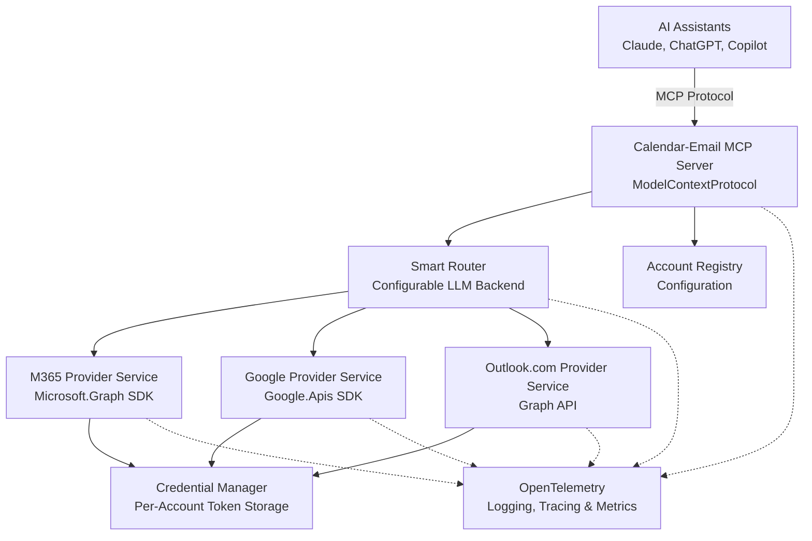

# Calendar & Email MCP - Design Specification

> **📚 Documentation has been reorganized!** This document now provides a high-level overview. For detailed information, see the comprehensive documentation in the [`/docs`](docs/) folder.

## Project Overview

An MCP (Model Context Protocol) server that provides a unified read and query interface for multiple email and calendar accounts across Microsoft 365 (multiple tenants), Outlook.com, and Google Workspace. This enables AI assistants (Claude Desktop, ChatGPT, GitHub Copilot, etc.) to access all your accounts simultaneously for tasks like summarizing emails across all inboxes, viewing consolidated calendar schedules, and finding available meeting times across all calendars.

## Problem Statement

Professionals working with multiple organizations often manage:
- Multiple M365 tenants (different work accounts)
- Personal Outlook.com accounts
- Google Workspace accounts
- Need unified AI-powered management across all accounts

Currently, no AI assistant (Claude, ChatGPT, Copilot) can access all these services simultaneously in a multi-tenant scenario.

## 📖 Documentation

Detailed documentation is organized by topic in the [`/docs`](docs/) folder:

### Core Architecture & Design
- **[Architecture](docs/architecture.md)** - High-level system design, components, and data flow
- **[MCP Tools](docs/mcp-tools.md)** - MCP tool definitions, workflows, and multi-account aggregation
- **[Routing](docs/routing.md)** - Smart router design, LLM backends, and account selection logic

### Authentication & Security
- **[Authentication](docs/authentication.md)** - Complete auth flows, token management, and per-account isolation
- **[Providers](docs/providers.md)** - Provider service implementations (M365, Google, Outlook.com)
- **[Security](docs/security.md)** - Security considerations, credential storage, and best practices

### Configuration & Setup
- **[Configuration](docs/configuration.md)** - All configuration examples (accounts, router, telemetry)
- **[Onboarding](docs/onboarding.md)** - CLI tool usage and account setup workflow
- **[Local Models](docs/local-models.md)** - Recommended models for local routing with Ollama

### Observability & Implementation
- **[Telemetry](docs/telemetry.md)** - OpenTelemetry setup, logging, tracing, and metrics
- **[Implementation Plan](docs/implementation-plan.md)** - Development phases, next steps, and success metrics

## Quick Start

1. **Prerequisites**: Create app registrations - see [Onboarding Prerequisites](docs/onboarding.md#prerequisites-app-registration-setup)
2. **Install CLI**: `dotnet tool install -g calendar-mcp-setup`
3. **Add Accounts**: `calendar-mcp-setup add-account` - see [Onboarding Guide](docs/onboarding.md)
4. **Configure Router**: Edit `appsettings.json` - see [Configuration Examples](docs/configuration.md)
5. **Test**: `calendar-mcp-setup test-account <account-id>`

## High-Level Architecture



**Key Principles**:
- **Provider ≠ Account**: One provider service manages multiple accounts with isolated credentials
- **Per-Account Isolation**: Every account has its own authentication context and token storage
- **Configurable AI**: Users choose their routing backend (local vs cloud)
- **Security First**: Encrypted token storage, minimal privilege scopes, privacy-first telemetry

> **📖 See [Architecture](docs/architecture.md)** for complete component descriptions, technical stack, and design principles.

## Key Features

### Phase 1 - Core Functionality
- Multi-account authentication and management
- Read-only email queries (unread, search, details)
- Read-only calendar queries (events, availability)
- Unified view aggregation across all accounts
- OpenTelemetry instrumentation for observability

### Phase 2 - Write Operations
- Send email from appropriate account (with smart routing)
- Create calendar events in appropriate calendar (with smart routing)
- Email threading and conversation tracking
- Advanced search with filters and date ranges

### Phase 3 - AI-Assisted Scheduling
- Intelligent meeting time suggestions across calendars
- Automated meeting coordination via email
- Conflict detection and resolution
- Meeting preparation summaries

> **📖 See [Implementation Plan](docs/implementation-plan.md)** for complete development roadmap, milestones, and timeline (~17 weeks / 4 months).

## MCP Tools

### Account Management
- `list_accounts` - Get all configured accounts

### Email Operations
- `get_emails` - Get emails for specific account or all accounts
- `search_emails` - Search emails by criteria
- `get_email_details` - Get full email content
- `send_email` - Send email from appropriate account

### Calendar Operations
- `list_calendars` - List all calendars
- `get_calendar_events` - Get events from calendars
- `find_available_times` - Find free time slots across all calendars
- `create_event` - Create calendar event
- `update_event` / `delete_event` - Manage events

> **📖 See [MCP Tools](docs/mcp-tools.md)** for complete tool definitions, parameters, and workflow examples.

## Technical Stack

- **Language**: C# / .NET 9+
- **MCP Framework**: ModelContextProtocol NuGet package (official .NET implementation)
- **Provider SDKs**: Microsoft.Graph, Google.Apis.Gmail/Calendar
- **AI Routing**: Configurable (Ollama, OpenAI, Anthropic, Azure OpenAI, custom)
- **Authentication**: OAuth 2.0 with MSAL (Microsoft) and GoogleWebAuthorizationBroker
- **Observability**: OpenTelemetry with multiple exporters

> **📖 See [Architecture](docs/architecture.md#technical-stack)** for complete dependency list and implementation strategy.

## Configuration Example

```json
{
  "accounts": [
    {
      "id": "xebia-work",
      "displayName": "Xebia Work Account",
      "provider": "microsoft365",
      "domains": ["xebia.com"],
      "configuration": {
        "tenantId": "...",
        "clientId": "...",
        "scopes": ["Mail.Read", "Mail.Send", "Calendars.ReadWrite"]
      }
    }
  ],
  "router": {
    "backend": "ollama",
    "model": "phi3.5:3.8b",
    "endpoint": "http://localhost:11434"
  },
  "telemetry": {
    "enabled": true,
    "redaction": {
      "redactEmailContent": true,
      "redactTokens": true,
      "redactPii": true
    }
  }
}
```

> **📖 See [Configuration](docs/configuration.md)** for complete examples including all providers, router backends, and telemetry settings.

## Authentication & Security

### Per-Account Token Storage

**Microsoft Accounts (M365 + Outlook.com)**:
- Encrypted token cache: `%LOCALAPPDATA%/CalendarMcp/msal_cache_{accountId}.bin`
- DPAPI encryption (Windows), Keychain (macOS)

**Google Accounts**:
- FileDataStore: `~/.credentials/calendar-mcp/{accountId}/`
- Per-account directory isolation

**Key Security Features**:
- ✅ Separate token cache per account
- ✅ OS-level encryption (Microsoft)
- ✅ File permissions restricted to current user
- ✅ Cross-account contamination prevention
- ✅ Automatic token refresh per account

> **📖 See [Authentication](docs/authentication.md)** for complete auth flows and token lifecycle.  
> **📖 See [Security](docs/security.md)** for comprehensive security best practices.

## Smart Routing

### Configurable LLM Backends

- **Local**: Ollama (Phi-3.5-mini, Qwen2-7B, Qwen2-1.5B)
- **Cloud**: OpenAI, Anthropic, Azure OpenAI
- **Custom**: Any OpenAI-compatible endpoint

### Routing Strategy

1. **Explicit Account ID** (highest priority)
2. **Domain Pattern Matching** (e.g., @company.com → work account)
3. **LLM Classification** (intelligent account selection)
4. **Default Account** (fallback)

> **📖 See [Routing](docs/routing.md)** for routing logic and examples.  
> **📖 See [Local Models](docs/local-models.md)** for Ollama model recommendations.

## Observability

### OpenTelemetry Integration

- **Structured Logging**: Consistent context across all components
- **Distributed Tracing**: End-to-end request tracking
- **Metrics Collection**: Performance and usage analytics
- **Multiple Exporters**: Console, OTLP, Jaeger, Prometheus, Azure Monitor
- **Privacy-First**: Built-in redaction of sensitive data

**Key Telemetry**:
- Router decision latency and accuracy
- Provider service response times
- Authentication success/failure rates
- Token cache hit/miss rates
- API call volumes per account

> **📖 See [Telemetry](docs/telemetry.md)** for configuration, instrumentation patterns, and metrics.

## Spike Projects (Completed ✅)

All three provider integrations have been validated through working spike projects:

- **[M365DirectAccess](spikes/M365DirectAccess/)** - Multi-tenant M365 support validated
- **[GoogleWorkspace](spikes/GoogleWorkspace/)** - Gmail + Calendar APIs validated
- **[OutlookComPersonal](spikes/OutlookComPersonal/)** - Personal MSA accounts validated

## Open Source Strategy

### License
MIT or Apache 2.0 - permissive to encourage adoption

### Target Audience
- Consultants managing multiple client accounts
- Contractors with multiple work engagements
- Professionals with separate work/personal accounts
- Anyone in multi-tenant scenarios

### Value Proposition
- No existing solution handles multi-tenant M365 + Google Workspace
- Configurable AI backend allows users to choose privacy/cost tradeoff
- Leverages proven MCP implementations
- Open source enables community contributions and customization

> **📖 See [Implementation Plan](docs/implementation-plan.md)** for success metrics, risk management, and community strategy.

## Next Steps

**Current Status**: ✅ Spike projects completed, ✅ Documentation organized

**Immediate Next Steps**:
1. Set up main project structure with ModelContextProtocol package
2. Define unified data models (EmailMessage, CalendarEvent, Account)
3. Implement provider services (M365, Google, Outlook.com)
4. Build MCP server with core tools
5. Implement smart router with configurable backends

> **📖 See [Implementation Plan](docs/implementation-plan.md)** for complete 8-phase development plan and ~17-week timeline.

## Contributing

This project will be open sourced under MIT or Apache 2.0 license. Contributions welcome!

**Areas for Contribution**:
- Additional provider implementations (iCloud, Exchange)
- Router accuracy improvements
- Performance optimizations
- Documentation and examples
- Testing and bug fixes

## Contact & Support

- **Repository**: (Will be public on GitHub)
- **Issues**: GitHub Issues (post-release)
- **Discussions**: GitHub Discussions (post-release)
- **Documentation**: [`/docs`](docs/) folder in repository
