# Calendar & Email MCP - Design Specification

## Project Overview

An MCP (Model Context Protocol) server that provides a unified read and query interface for multiple email and calendar accounts across Microsoft 365 (multiple tenants), Outlook.com, and Google Workspace. This enables AI assistants (Claude Desktop, ChatGPT, GitHub Copilot, etc.) to access all your accounts simultaneously for tasks like summarizing emails across all inboxes, viewing consolidated calendar schedules, and finding available meeting times across all calendars.

## Problem Statement

Professionals working with multiple organizations often manage:
- Multiple M365 tenants (different work accounts)
- Personal Outlook.com accounts
- Google Workspace accounts
- Need unified AI-powered management across all accounts

Currently, no AI assistant (Claude, ChatGPT, Copilot) can access all these services simultaneously in a multi-tenant scenario.

## Solution Architecture

### High-Level Architecture


**Important**: While we have three *provider services* (M365, Google, Outlook.com), each *account* is a unique entity with its own authentication tokens. For example:
- Two M365 accounts (different tenants) = same provider service, different token caches
- M365 account + Outlook.com account = different provider services, different token caches
- Two Google accounts (different users) = same provider service, different token caches

**Provider ≠ Account**: A provider service can manage multiple accounts, each with isolated credentials.

### Core Components

#### 1. MCP Server Interface (ModelContextProtocol Package)
- **Exposes MCP tools** to AI assistants for unified email/calendar queries
- **Core Tools**:
  - `list_accounts` - Get list of all configured accounts across all providers
  - `get_emails` - Get emails (unread/read, filtered by count) for specific account or all accounts
  - `search_emails` - Search emails by sender/subject/criteria for specific account or all accounts
  - `get_email_details` - Get full email content including body and attachments
  - `list_calendars` - List all calendars from specific account or all accounts
  - `get_calendar_events` - Get events (past/present/future) for specific account or all accounts
  - `find_available_times` - Find free time slots across specified or all calendars
  - `send_email` - Send email from specific account (requires explicit account selection or smart routing)
  - `create_event` - Create calendar event in specific calendar (requires explicit account selection or smart routing)
  - `update_event` - Update existing calendar event
  - `delete_event` - Delete calendar event
- **Transport**: Supports stdio (primary), SSE, and WebSocket transports
- **Configuration**: Account setup and router configuration via JSON config files and MCP resources

#### 2. Account Registry
- Configuration-based mapping of accounts to providers and credentials
- Supports multiple M365 tenants, Outlook.com, and Google Workspace accounts
- Account metadata:
  - Unique account ID
  - Provider type (microsoft365, outlook.com, google)
  - Display name for user reference
  - Email domains for smart routing
  - Priority for ambiguous routing decisions
  - Provider-specific configuration (tenant ID, client ID, etc.)
- Persisted in JSON configuration files
- Validates account configuration on startup
- Provides account lookup by ID, domain, or criteria

#### 3. Smart Router
- **Configurable AI Backend** - Key Design Principle
- Routes requests to appropriate provider service and account
- Uses LLM for intelligent account selection when not explicitly specified
- Supports multiple backend options:
  - Local models via Ollama (Phi-3.5-mini, Qwen2-7B, etc.)
  - Cloud APIs (OpenAI, Anthropic, Azure OpenAI)
  - Custom model endpoints
- Classification based on:
  - Explicit account ID in tool parameters (highest priority)
  - Email domain patterns (e.g., @company.com → work account)
  - Content keywords and context (e.g., "work project" → work account)
  - User preferences and routing rules
  - Historical patterns
- Returns account ID and provider type for service selection

#### 4. Provider Services (Dependency Injection)

**Key Principle**: One provider service instance manages multiple accounts of that provider type, with strict per-account token isolation.

- **IM365ProviderService**: Direct Microsoft Graph API integration
  - Uses Microsoft.Graph NuGet package
  - MSAL (Microsoft.Identity.Client) for authentication
  - **Manages multiple M365 accounts** (different tenants) simultaneously
  - **App Registration Options**:
    - **Option A (Shared)**: Single app registration used across multiple tenants
      - Simpler setup, one ClientId for all accounts
      - Works when tenant admins allow external apps
      - Requires multi-tenant app registration ("Accounts in any organizational directory")
    - **Option B (Per-Tenant)**: Separate app registration per tenant
      - Required when tenant IT policies restrict external apps
      - Each tenant admin creates/approves their own app registration
      - More granular control, tenant-specific permissions
    - **User Choice**: Configuration supports both models
  - **Critical - Authentication**: Each account has its own `IPublicClientApplication` instance
    - Built with that account's specific ClientId (shared or per-tenant) and TenantId
  - **Critical - Token Storage**: Each account has separate token cache file: `msal_cache_{accountId}.bin`
  - Token isolation prevents cross-tenant contamination
  - Operations: email (read/send), calendar (CRUD), contacts
  - Pattern: `MultiTenantAuthenticator` manages dictionary of `IPublicClientApplication` by accountId
  
- **IGoogleProviderService**: Direct Google Workspace API integration
  - Uses Google.Apis.Gmail and Google.Apis.Calendar NuGet packages
  - OAuth 2.0 with GoogleWebAuthorizationBroker
  - **Manages multiple Google accounts** (different users) simultaneously
  - **OAuth Client Options**:
    - **Option A (Shared)**: Single OAuth client (ClientId/Secret) for all accounts
      - Simpler setup, works for most personal Gmail accounts
      - Often acceptable for Workspace accounts unless restricted by admin
      - One Google Cloud project serves all accounts
    - **Option B (Per-Organization)**: Separate OAuth client per organization/domain
      - Required when Workspace admin policies restrict external OAuth apps
      - Each organization's admin creates/approves their own OAuth client
      - Better for enterprise scenarios with strict policies
    - **User Choice**: Configuration supports both models
  - **Critical - Authentication**: Each account has separate `UserCredential` instance
    - Built with that account's OAuth credentials (shared or per-org)
  - **Critical - Token Storage**: Each account has separate FileDataStore directory: `~/.credentials/calendar-mcp/{accountId}/`
  - Token isolation prevents cross-account contamination
  - Operations: Gmail (read/send/search), Calendar (CRUD)
  - Pattern: Dictionary of `GoogleAuthenticator` instances by accountId, each managing its own service instances
  
- **IOutlookComProviderService**: Microsoft Graph API for personal accounts
  - Uses Microsoft.Graph NuGet package (same as M365)
  - MSAL authentication with 'common' tenant for MSA support
  - **Manages multiple Outlook.com accounts** (different personal accounts) simultaneously
  - **App Registration**: Typically uses single shared app registration for all personal accounts
    - One ClientId with 'common' tenant serves all Outlook.com accounts
    - Each user consents to app permissions for their account
    - Simpler than per-account registrations for personal use
  - **Critical - Authentication**: Each account has its own `IPublicClientApplication` instance
    - Built with shared ClientId and 'common' tenant
  - **Critical - Token Storage**: Each account has separate token cache file: `msal_cache_{accountId}.bin`
  - Token isolation prevents cross-account contamination
  - Operations: email (read/send), calendar (CRUD)
  - Pattern: Similar to M365ProviderService but with 'common' tenant and personal scopes

- **Provider Service Factory**:
  - Resolves correct provider service based on account type (microsoft365, google, outlook.com)
  - **Single instance per provider type** (one M365 service, one Google service, one Outlook.com service)
  - Each provider service internally manages multiple accounts with isolated credentials
  - Maintains service instance lifecycle
  - Handles service initialization and disposal

#### 5. Credential Manager

**Critical Design Principle**: Token storage is **PER-ACCOUNT**, not per-provider.

### Account Isolation Hierarchy

```
Provider (M365, Google, Outlook.com)
  ↓
Account (xebia-work, marimer-work, rocky-gmail, etc.)
  ↓
App Registration / OAuth Client (shared OR per-tenant, user configurable)
  ↓
Authentication Instance (IPublicClientApplication / UserCredential)
  ↓
Token Cache (unique per account - ALWAYS separate)
```

**App Registration Models**

#### Model 1: Shared App Registration (Simpler)
**Microsoft 365**:
- **One app registration** used across multiple tenants
- App must be multi-tenant ("Accounts in any organizational directory")
- Works when tenant admins allow external apps
- User's choice of ClientId in each account config
- **Example**: Single ClientId (`aaa...`) shared by Xebia, Marimer, and other tenants

**Google**:
- **One OAuth client** used across multiple accounts
- Works for personal Gmail and most Workspace accounts
- Single Google Cloud project with one set of credentials
- **Example**: Single ClientId shared by personal Gmail + multiple Workspace accounts

**Outlook.com**:
- **One app registration** with 'common' tenant
- Standard approach for personal accounts
- All Outlook.com accounts share the same ClientId

#### Model 2: Per-Tenant App Registration (When Required)
**Microsoft 365**:
- **Separate app registration per tenant**
- Required when tenant IT policies block external apps
- Each tenant admin creates their own app registration
- More control, tenant-specific permissions
- **Example**: Xebia uses ClientId `aaa...`, Marimer uses ClientId `bbb...`

**Google Workspace**:
- **Separate OAuth client per organization**
- Required when Workspace admin restricts external OAuth apps
- Each organization creates their own Google Cloud project
- **Example**: Personal uses ClientId `123...`, Marimer Workspace uses ClientId `456...`

**Why Configuration Flexibility?**
- Different organizations have different security policies
- Shared app = simpler setup, fewer app registrations to manage
- Per-tenant app = required for strict IT environments
- **Calendar-MCP supports both**: User configures ClientId per account as needed

**Why Per-Account?**
- Different accounts = different authentication contexts
- M365: Different tenants = completely separate identity domains
- Google: Different users = different OAuth credentials
- Outlook.com: Different personal accounts = different MSA identities
- **Mixing tokens across accounts = security vulnerability**

### Per-Account Token Storage

#### Microsoft Accounts (M365 + Outlook.com)
**Storage Mechanism**: MSAL encrypted token cache via `MsalCacheHelper`

**Per-Account Cache File**:
```
%LOCALAPPDATA%/CalendarMcp/msal_cache_{accountId}.bin
```

Examples:
- `msal_cache_xebia-work.bin` (M365 tenant 1)
- `msal_cache_marimer-work.bin` (M365 tenant 2)
- `msal_cache_rocky-outlook.bin` (Outlook.com personal)

**Implementation Pattern** (from M365DirectAccess spike):
```csharp
// Each account gets its own IPublicClientApplication instance
var cacheFileName = $"msal_cache_{accountId}.bin";
var cacheFilePath = Path.Combine(
    Environment.GetFolderPath(Environment.SpecialFolder.LocalApplicationData),
    "CalendarMcp",
    cacheFileName
);

var app = PublicClientApplicationBuilder
    .Create(tenant.ClientId)
    .WithAuthority($"https://login.microsoftonline.com/{tenant.TenantId}")
    .WithRedirectUri("http://localhost")
    .Build();

var storageProperties = new StorageCreationPropertiesBuilder(
    cacheFileName, 
    Path.GetDirectoryName(cacheFilePath))
    .Build();
    
var cacheHelper = await MsalCacheHelper.CreateAsync(storageProperties);
cacheHelper.RegisterCache(app.UserTokenCache);
```

**Security**:
- ✅ Automatic encryption on Windows (DPAPI)
- ✅ Automatic encryption on macOS (Keychain)
- ✅ File permissions restrict to current user
- ✅ Separate cache files prevent cross-tenant/cross-account token leakage

#### Google Accounts
**Storage Mechanism**: FileDataStore via GoogleWebAuthorizationBroker

**Per-Account Directory**:
```
~/.credentials/calendar-mcp/{accountId}/
  └── Google.Apis.Auth.OAuth2.Responses.TokenResponse-{userEmail}
```

Examples:
- `~/.credentials/calendar-mcp/rocky-gmail/` (personal Gmail)
- `~/.credentials/calendar-mcp/marimer-gsuite/` (G Suite account)

**Implementation Pattern** (from GoogleWorkspace spike):
```csharp
// Each account gets separate FileDataStore directory
var credPath = Path.Combine(
    Environment.GetFolderPath(Environment.SpecialFolder.UserProfile),
    ".credentials",
    $"calendar-mcp-{accountId}"
);

var credential = await GoogleWebAuthorizationBroker.AuthorizeAsync(
    secrets,
    scopes,
    account.UserEmail,
    CancellationToken.None,
    new FileDataStore(credPath, true)
);
```

**Security**:
- ⚠️ Plaintext JSON storage (access/refresh tokens)
- ✅ File permissions restrict to current user only
- ✅ Separate directories prevent cross-account token leakage
- 💡 Future enhancement: Encrypt tokens before writing to FileDataStore

### Authentication Flow (Per-Account)

1. **Initial Setup** (via `calendar-mcp-setup` CLI):
   ```
   For EACH account:
     → User runs: calendar-mcp-setup add-account
     → Opens browser for OAuth (account-specific)
     → User authenticates to specific tenant/account
     → Tokens saved to account-specific cache file/directory
     → Account config added to appsettings.json
   ```

2. **MCP Server Startup**:
   ```
   For EACH configured account:
     → Load account config from registry
     → Initialize provider-specific authenticator for this account
     → Attempt silent token acquisition from account's cache
     → If successful: Account ready
     → If token expired: Automatic refresh using account's refresh token
     → If refresh fails: Log error, mark account as unavailable
   ```

3. **Runtime**:
   ```
   Tool execution:
     → Router determines target account(s)
     → Provider service retrieves authenticator for specific accountId
     → Uses that account's cached tokens
     → Automatic refresh if expired
     → All operations scoped to correct account context
   ```

### Token Lifecycle (Per-Account)

- **Access tokens**: 
  - Short-lived (typically 1 hour)
  - Used for API calls
  - Account-specific scope and permissions
  
- **Refresh tokens**: 
  - Long-lived (until explicitly revoked)
  - Used to obtain new access tokens
  - **Critical**: Each account has its own refresh token
  - Revocation via provider admin console (per-account)

- **Automatic Refresh**:
  - Happens transparently per-account
  - Uses that account's refresh token
  - Updates that account's cache file
  - Does not affect other accounts

### Cross-Account Contamination Prevention

**What Could Go Wrong** (if not per-account):
```
❌ Account A's tokens used for Account B's API calls
❌ Tenant 1 user trying to access Tenant 2 resources
❌ Personal account tokens mixed with work account
❌ Gmail user 1 seeing emails from Gmail user 2
```

**How We Prevent This**:
```
✅ Separate cache files/directories per account
✅ Separate IPublicClientApplication per M365/Outlook account
✅ Separate UserCredential per Google account
✅ Account ID always required in provider service calls
✅ Dictionary lookups by accountId in provider services
✅ No shared authentication state between accounts
```

#### 6. Workflow Engine
- Aggregates data from multiple accounts
- Examples:
  - "Summarize all my unread emails from the last 24 hours"
  - "Show me my calendar for tomorrow across all accounts"
  - "Find 1-hour slots next week where I'm free across all calendars"
  - "What emails do I have about the Acme project?"
- Orchestrates multiple MCP server calls in parallel
- Merges and deduplicates results from different sources

#### 6. OpenTelemetry Integration
- **Structured Logging**: Consistent log formatting across all components
- **Distributed Tracing**: End-to-end request tracking across MCP servers
- **Metrics Collection**: Performance monitoring and usage analytics
- **Exporters**: Support for multiple backends
  - Console (development)
  - OTLP (OpenTelemetry Protocol)
  - Jaeger (distributed tracing)
  - Prometheus (metrics)
  - Azure Monitor / Application Insights
- **Key Telemetry**:
  - Router decision latency and accuracy
  - Provider service response times (per provider type)
  - Authentication success/failure rates (per account)
  - Token cache hit/miss rates
  - API call volumes per account and provider
  - Parallel aggregation performance
  - Error rates and exception tracking
  - Rate limit warnings

## Configuration Design

### Model Configuration
The router's AI backend should be fully configurable to allow users to choose based on their preferences and resources:

```json
{
  "router": {
    "backend": "ollama|openai|anthropic|azure|custom",
    "model": {
      "ollama": {
        "model": "phi3.5:3.8b",
        "endpoint": "http://localhost:11434"
      },
      "openai": {
        "model": "gpt-4o-mini",
        "apiKey": "${OPENAI_API_KEY}"
      },
      "anthropic": {
        "model": "claude-sonnet-4-20250514",
        "apiKey": "${ANTHROPIC_API_KEY}"
      },
      "azure": {
        "model": "gpt-4o-mini",
        "endpoint": "${AZURE_ENDPOINT}",
        "apiKey": "${AZURE_API_KEY}"
      },
      "custom": {
        "endpoint": "https://custom-endpoint.com/v1/chat",
        "model": "custom-model-name",
        "apiKey": "${CUSTOM_API_KEY}"
      }
    },
    "temperature": 0.3,
    "maxTokens": 500
  }
}
```

### OpenTelemetry Configuration

```json
{
  "telemetry": {
    "serviceName": "calendar-email-mcp",
    "serviceVersion": "1.0.0",
    "logging": {
      "level": "Information",
      "console": true,
      "structured": true
    },
    "tracing": {
      "enabled": true,
      "samplingRatio": 1.0,
      "exporters": ["console", "otlp"]
    },
    "metrics": {
      "enabled": true,
      "intervalSeconds": 60,
      "exporters": ["console", "prometheus"]
    },
    "exporters": {
      "otlp": {
        "endpoint": "http://localhost:4317",
        "protocol": "grpc"
      },
      "jaeger": {
        "endpoint": "http://localhost:14268/api/traces"
      },
      "prometheus": {
        "port": 9090,
        "endpoint": "/metrics"
      },
      "azureMonitor": {
        "connectionString": "${APPLICATIONINSIGHTS_CONNECTION_STRING}"
      }
    }
  }
}
```

### Account Configuration

**Each account entry represents a unique authentication context with:**
- Its own app registration / OAuth client credentials (can be shared or unique)
- Its own authentication instance
- Its own token cache (ALWAYS unique)

**Two Configuration Patterns Shown Below:**
1. **Shared App Pattern**: M365 accounts share one multi-tenant ClientId
2. **Per-Tenant App Pattern**: Each M365 tenant has its own ClientId

```json
{
  "accounts": [
    // Pattern 1: Shared App Registration (simpler)
    // Both Xebia and Marimer use the SAME multi-tenant app
    {
      "id": "xebia-work",
      "type": "microsoft365",
      "displayName": "Xebia Work Account",
      "enabled": true,
      "domains": ["xebia.com"],
      "priority": 1,
      "provider": {
        "tenantId": "xxxxxxxx-xxxx-xxxx-xxxx-xxxxxxxxxxxx",  // Xebia's tenant
        "clientId": "shared-app-1111-1111-1111-111111111111",  // SHARED multi-tenant app
        "scopes": [
          "https://graph.microsoft.com/Mail.ReadWrite",
          "https://graph.microsoft.com/Calendars.ReadWrite",
          "https://graph.microsoft.com/offline_access"
        ]
      }
      // App: Multi-tenant app registration shared across tenants
      // Auth: IPublicClientApplication with shared clientId + Xebia tenantId
      // Token cache: msal_cache_xebia-work.bin (SEPARATE despite shared app!)
    },
    {
      "id": "marimer-work",
      "type": "microsoft365",
      "displayName": "Marimer Work Account",
      "enabled": true,
      "domains": ["marimer.com"],
      "priority": 2,
      "provider": {
        "tenantId": "yyyyyyyy-yyyy-yyyy-yyyy-yyyyyyyyyyyy",  // Marimer's tenant
        "clientId": "shared-app-1111-1111-1111-111111111111",  // SAME shared app!
        "scopes": [
          "https://graph.microsoft.com/Mail.ReadWrite",
          "https://graph.microsoft.com/Calendars.ReadWrite",
          "https://graph.microsoft.com/offline_access"
        ]
      }
      // App: Same multi-tenant app as Xebia
      // Auth: IPublicClientApplication with shared clientId + Marimer tenantId
      // Token cache: msal_cache_marimer-work.bin (SEPARATE from Xebia!)
    },

    // Pattern 2: Per-Tenant App Registration (when required by IT)
    // Alternative config if IT policy requires separate apps
    /*
    {
      "id": "xebia-work",
      "type": "microsoft365",
      "provider": {
        "tenantId": "xxxxxxxx-xxxx-xxxx-xxxx-xxxxxxxxxxxx",
        "clientId": "xebia-app-aaaa-aaaa-aaaa-aaaaaaaaaaaa",  // Xebia-specific app
        "scopes": [...]
      }
    },
    {
      "id": "marimer-work",
      "type": "microsoft365",
      "provider": {
        "tenantId": "yyyyyyyy-yyyy-yyyy-yyyy-yyyyyyyyyyyy",
        "clientId": "marimer-app-bbbb-bbbb-bbbb-bbbbbbbbbbbb",  // Marimer-specific app (DIFFERENT)
        "scopes": [...]
      }
    },
    */
    {
      "id": "rocky-gmail",                   // Personal Google account
      "type": "google",
      "displayName": "Rocky Personal Gmail",
      "enabled": true,
      "domains": ["lhotka.net"],
      "priority": 3,
      "provider": {
        "userEmail": "rocky@lhotka.net",      // Google user email
        "clientId": "123456789.apps.googleusercontent.com",      // OAuth client (can be shared for personal)
        "clientSecret": "GOCSPX-xxxxxxxxxxxxx",                  // OAuth secret
        "scopes": [
          "https://www.googleapis.com/auth/gmail.readonly",
          "https://www.googleapis.com/auth/gmail.send",
          "https://www.googleapis.com/auth/calendar.readonly",
          "https://www.googleapis.com/auth/calendar.events"
        ]
      }
      // OAuth Client: Can be shared across personal Gmail accounts
      // Auth: UserCredential for rocky@lhotka.net
      // Token cache: ~/.credentials/calendar-mcp/rocky-gmail/
    },
    {
      "id": "rocky-marimer-gmail",          // Workspace Google account
      "type": "google",
      "displayName": "Rocky Marimer Gmail",
      "enabled": true,
      "domains": ["marimer.com"],
      "priority": 4,
      "provider": {
        "userEmail": "rocky@marimer.com",     // Workspace user email
        "clientId": "987654321.apps.googleusercontent.com",      // Different OAuth client (Workspace)
        "clientSecret": "GOCSPX-yyyyyyyyyyyyy",                  // Different secret
        "scopes": [
          "https://www.googleapis.com/auth/gmail.readonly",
          "https://www.googleapis.com/auth/gmail.send",
          "https://www.googleapis.com/auth/calendar.readonly",
          "https://www.googleapis.com/auth/calendar.events"
        ]
      }
      // OAuth Client: Marimer Workspace-specific (may be required by admin policy)
      // Auth: UserCredential for rocky@marimer.com
      // Token cache: ~/.credentials/calendar-mcp/rocky-marimer-gmail/
    },
    {
      "id": "rocky-outlook",                 // Personal Outlook.com account
      "type": "outlook.com",
      "displayName": "Rocky Personal Outlook",
      "enabled": true,
      "domains": ["outlook.com"],
      "priority": 5,
      "provider": {
        "tenantId": "common",                 // MSA uses 'common' tenant
        "clientId": "cccccccc-cccc-cccc-cccc-cccccccccccc",  // App registration for personal accounts
        "scopes": [
          "https://graph.microsoft.com/Mail.ReadWrite",
          "https://graph.microsoft.com/Calendars.ReadWrite",
          "https://graph.microsoft.com/offline_access"
        ]
      }
      // App: Created in Azure AD for consumer accounts
      // Auth: IPublicClientApplication with 'common' tenant
      // Token cache: msal_cache_rocky-outlook.bin
    }
  ]
}
```

**Key Points**:
- `id` field is unique per account and used as token cache identifier
- **Each account specifies its app registration / OAuth client credentials (ClientId)**
  - **Same ClientId**: Accounts can share app registration (simpler, works in many cases)
  - **Different ClientId**: Accounts can use separate app registrations (required by some IT policies)
- M365 accounts: 
  - Can share `clientId` if using multi-tenant app registration
  - Or use different `clientId` per tenant if required by IT policy
- Google accounts: 
  - Can share `clientId` across personal and many Workspace accounts
  - Or use different `clientId` per organization if required by admin policy
- Each account authenticates independently during onboarding
- **Token caches ALWAYS separate per account** (even when sharing ClientId)
- User decides based on their organization's requirements

## Recommended Local Models

For users choosing local Ollama models, recommended options:

### Phi-3.5-mini (3.8B) - Recommended Default
- Excellent classification accuracy
- 128K context length
- ~2.4GB quantized
- Fast inference (12+ tokens/sec on modest hardware)
- Strong reasoning capabilities

### Qwen2-7B
- Excellent structured data understanding
- Strong logic-based routing
- Good for complex decision-making

### Qwen2-1.5B
- Ultra-lightweight
- Blazing fast routing
- Good for simpler classification tasks
- Minimal resource usage

## Key Features

### Phase 1 - Core Functionality
1. Multi-account authentication and management
2. Read-only email queries (unread, search, details)
3. Read-only calendar queries (events, availability)
4. Unified view aggregation across all accounts
5. OpenTelemetry instrumentation for observability

### Phase 2 - Write Operations
1. Send email from appropriate account (with smart routing)
2. Create calendar events in appropriate calendar (with smart routing)
3. Email threading and conversation tracking
4. Advanced search with filters and date ranges

### Phase 3 - AI-Assisted Scheduling
1. Intelligent meeting time suggestions across calendars
2. Automated meeting coordination via email
   - Find times that work for you
   - Email participants to find times that work for them
   - Propose optimal meeting times
3. Conflict detection and resolution
4. Meeting preparation summaries

## Technical Stack

- **Language**: C# / .NET 9+ (target .NET 10 when available)
- **MCP Server Framework**: ModelContextProtocol NuGet package (official .NET implementation)
- **Provider SDKs**:
  - **Microsoft.Graph** (v5.x) - M365 and Outlook.com
  - **Microsoft.Identity.Client** (v4.x) - MSAL authentication
  - **Microsoft.Identity.Client.Extensions.Msal** - Token cache helpers
  - **Google.Apis.Gmail.v1** - Gmail API
  - **Google.Apis.Calendar.v3** - Google Calendar API
  - **Google.Apis.Auth** - Google OAuth 2.0
- **AI Routing**: Configurable LLM backend
  - Local: Ollama (Phi-3.5-mini, Qwen2-7B, etc.)
  - Cloud: OpenAI, Anthropic, Azure OpenAI
  - Custom: Any OpenAI-compatible endpoint
- **Dependency Injection**: Microsoft.Extensions.DependencyInjection
- **Configuration**: Microsoft.Extensions.Configuration (JSON + environment variables)
- **Logging**: Microsoft.Extensions.Logging
- **Authentication**: OAuth 2.0 with provider-specific implementations
  - Microsoft: MSAL with encrypted token cache
  - Google: GoogleWebAuthorizationBroker with FileDataStore
- **Observability**: OpenTelemetry for comprehensive telemetry
  - OpenTelemetry .NET SDK
  - OTLP exporters (Jaeger, Prometheus, Azure Monitor)
  - Instrumentation for HTTP, custom spans, and metrics
- **Async/Parallel**: Native .NET async/await with Task.WhenAll for multi-account aggregation

## SDK Dependencies & Implementation Strategy

### Validated Through Spikes

All three provider integrations have been validated through working spike projects in `spikes/`:

#### Microsoft 365 (M365DirectAccess spike)
- **SDK**: Microsoft.Graph (v5.68.0+), Microsoft.Identity.Client (v4.66.2+)
- **Status**: ✅ Fully validated with multi-tenant support
- **Authentication**: MSAL with encrypted token cache per tenant
- **Key Findings**:
  - Native multi-tenant support using separate MSAL app per tenant
  - Excellent parallel async performance
  - Automatic token refresh
  - No external process dependencies
- **Pattern**: `MultiTenantAuthenticator` manages multiple `IPublicClientApplication` instances

#### Google Workspace (GoogleWorkspace spike)
- **SDK**: Google.Apis.Gmail.v1, Google.Apis.Calendar.v3, Google.Apis.Auth
- **Status**: ✅ Fully validated with Gmail and Calendar operations
- **Authentication**: OAuth 2.0 via GoogleWebAuthorizationBroker with FileDataStore
- **Key Findings**:
  - Complete Gmail and Calendar API coverage
  - Rich Gmail search query syntax
  - Multi-account support via separate token stores
  - Browser-based OAuth flow with persistent tokens
  - Token refresh automatic
- **Pattern**: `GoogleAuthenticator` → separate `GmailService` and `GoogleCalendarService` instances

#### Outlook.com Personal (OutlookComPersonal spike)
- **SDK**: Microsoft.Graph (same as M365), Microsoft.Identity.Client
- **Status**: ✅ Validated for personal Microsoft accounts
- **Authentication**: MSAL with 'common' tenant for MSA support
- **Key Findings**:
  - Uses same Graph API as M365 but with different auth flow
  - Personal account scopes work correctly
  - Same token cache approach as M365
- **Pattern**: Nearly identical to M365, just different tenant configuration

### Implementation Strategy

Based on spike findings, Calendar-MCP will:

1. **Use Direct SDK Integration** - No external MCP servers or Node.js processes
   - Simpler architecture
   - Better performance (no IPC overhead)
   - Native .NET debugging experience
   - Consistent with proven spike patterns

2. **Dependency Injection Pattern**:
   ```csharp
   services.AddSingleton<IM365ProviderService, M365ProviderService>();
   services.AddSingleton<IGoogleProviderService, GoogleProviderService>();
   services.AddSingleton<IOutlookComProviderService, OutlookComProviderService>();
   services.AddSingleton<IProviderServiceFactory, ProviderServiceFactory>();
   ```

3. **Multi-Account Management**:
   - Account registry loads from configuration
   - Each provider service manages multiple accounts of its type
   - **Critical**: Provider service maintains internal dictionary of authenticators by accountId
   - Each account has isolated token cache (per-account token storage)
   - Provider service factory resolves correct service based on account type
   - Parallel operations across accounts using `Task.WhenAll()`
   - API calls always include accountId to ensure correct token usage

4. **Authentication Flow** (Per-Account):
   - **First run**: Interactive OAuth **per account** (browser-based)
     - Each account authenticates separately
     - User may need to sign in to multiple tenants/users
   - **Tokens cached** in account-specific location:
     - Microsoft: `msal_cache_{accountId}.bin`
     - Google: `~/.credentials/calendar-mcp/{accountId}/`
   - **Subsequent runs**: Silent token acquisition from **that account's** cache
   - **Automatic refresh**: Uses **that account's** refresh token
   - **Re-auth**: Only if **that specific account's** refresh token invalid
   - **Isolation**: Account A's authentication failure doesn't affect Account B

5. **Unified Data Models**:
   - Abstract provider differences behind common interfaces
   - `EmailMessage`, `CalendarEvent`, `Calendar` models
   - Provider services map native API responses to unified models
   - MCP tools work with unified models only

## Account Onboarding

### Challenge: Non-Interactive Token Management

MCP servers typically run in a non-interactive context (called by AI assistants), but OAuth requires browser interaction for initial authentication.

### Prerequisites: App Registration Setup

**BEFORE using calendar-mcp-setup, users must create app registrations:**

**Note**: You can create ONE app registration shared across accounts, OR separate registrations per tenant/organization, depending on your IT policies.

#### Microsoft 365 / Outlook.com Accounts

**Option A - Shared App Registration (Recommended for simplicity):**

1. Create **one multi-tenant app registration** to use across all M365 tenants:
   - Go to [Azure Portal](https://portal.azure.com) → Azure Active Directory → App registrations
   - Click "New registration"
   - **Supported account types**: "Accounts in any organizational directory" (multi-tenant)
   - **Redirect URI**: Public client/native → `http://localhost`
   - Note the **Application (client) ID** - use this for ALL M365 accounts
   - Configure API permissions (Graph: Mail.ReadWrite, Calendars.ReadWrite, offline_access)
   - Enable "Allow public client flows" = Yes
   - **Each tenant admin must consent** when their users first authenticate

**Option B - Per-Tenant App Registration (When required by IT policy):**

1. Create **separate app registration in each tenant's Azure AD**:

   - Go to [Azure Portal](https://portal.azure.com) → Azure Active Directory → App registrations
   - Click "New registration" **in each tenant**
   - **Name**: "Calendar MCP - {TenantName}" (e.g., "Calendar MCP - Xebia")
   - **Supported account types**: "Accounts in this organizational directory only" (single tenant)
   - **Redirect URI**: Public client/native → `http://localhost`
   - After creation, note the **Application (client) ID** (different per tenant)
   - Configure API permissions (Graph: Mail.ReadWrite, Calendars.ReadWrite, offline_access)
   - Enable "Allow public client flows" = Yes
   - Each tenant has its own ClientId

**Outlook.com (Personal Accounts):**
- Create one app registration with "Personal Microsoft accounts only"
- Use this shared ClientId for all Outlook.com accounts

**Choose based on your needs**: Option A (shared) is simpler. Option B (per-tenant) is required if tenant IT policies block external apps.

#### Google Workspace / Gmail Accounts

**Option A - Shared OAuth Client (Recommended for simplicity):**

1. Create **one OAuth client** to use across all Google accounts:
   - Go to [Google Cloud Console](https://console.cloud.google.com)
   - Create a new project (or use existing)
   - Enable APIs: Gmail API, Google Calendar API
   - Go to "Credentials" → "Create Credentials" → "OAuth client ID"
   - **Application type**: Desktop app
   - Note the **Client ID** and **Client Secret** - use for ALL accounts
   - Configure OAuth consent screen with required scopes
   - Works for personal Gmail and most Workspace accounts

**Option B - Per-Organization OAuth Client (When required by policy):**

1. Create **separate OAuth client per Workspace organization**:
   - Each organization creates their own Google Cloud project
   - Separate Client ID / Secret per organization
   - Required when Workspace admin restricts external OAuth apps
   - More control, org-specific approval

**Choose based on your needs**: Option A (shared) works for most users. Option B (per-org) is required if Workspace admins enforce OAuth restrictions.

**Summary**: 
- **Shared app approach**: Simpler, one ClientId for multiple accounts, works in most cases
- **Per-tenant/org approach**: Required when IT policies restrict external apps
- **Calendar-MCP supports both**: Configure ClientId per account based on your requirements

### Solution: CLI Onboarding Tool

**Approach**: Separate CLI tool for initial account setup after creating app registrations.

#### `calendar-mcp-setup` CLI Tool

```bash
# Add a new account
calendar-mcp-setup add-account

# Interactive prompts:
# 1. Account type? (microsoft365 / google / outlook.com)
# 2. Account ID (unique identifier)?
# 3. Display name?
# 4. [Provider-specific config: tenant ID, client ID, etc.]
#
# → Opens browser for OAuth authentication
# → Saves token to credential store
# → Adds account to configuration

# List configured accounts
calendar-mcp-setup list-accounts

# Test account authentication
calendar-mcp-setup test-account <account-id>

# Remove account
calendar-mcp-setup remove-account <account-id>

# Refresh expired credentials
calendar-mcp-setup refresh-account <account-id>
```

#### Onboarding Flow

```mermaid
sequenceDiagram
    participant User
    participant CLI as calendar-mcp-setup
    participant Browser
    participant Provider as OAuth Provider
    participant Config as appsettings.json
    participant Cache as Token Cache
    
    User->>CLI: calendar-mcp-setup add-account
    CLI->>User: Prompt for account details
    User->>CLI: Provide: type, id, display name, app credentials
    CLI->>Browser: Open OAuth URL
    Browser->>Provider: User signs in
    Provider->>Browser: Authorization code
    Browser->>CLI: Redirect with code
    CLI->>Provider: Exchange for tokens
    Provider->>CLI: Access + Refresh tokens
    CLI->>Cache: Save tokens (encrypted)
    CLI->>Config: Add account configuration
    CLI->>User: ✓ Account added successfully
```



#### Configuration Storage

**Account metadata** (appsettings.json):
```json
{
  "accounts": [
    {
      "id": "xebia-work",
      "type": "microsoft365",
      "displayName": "Xebia Work",
      "enabled": true,
      "domains": ["xebia.com"],
      "priority": 1,
      "provider": {
        "tenantId": "xxx",
        "clientId": "xxx"
      }
    }
  ]
}
```

**Credentials/tokens** (secure storage):
- **Microsoft**: `%LOCALAPPDATA%/CalendarMcp/msal_cache_{accountId}.bin` (encrypted)
- **Google**: `~/.credentials/calendar-mcp/{accountId}/` (JSON files)

#### MCP Server Startup

1. Load account registry from `appsettings.json`
2. For each enabled account:
   - Initialize provider service
   - Load cached tokens (silent authentication)
   - If token valid → ready
   - If token expired → automatic refresh using refresh token
   - If refresh fails → log error, disable account, notify user to re-run setup
3. Expose MCP tools only for accounts with valid authentication

#### Benefits

✅ **Separation of Concerns**: Setup separate from runtime
✅ **User Experience**: Clear, interactive onboarding process
✅ **Security**: OAuth flow in controlled CLI context
✅ **Automation**: MCP server runs non-interactively after setup
✅ **Troubleshooting**: Easy to test/refresh individual accounts

#### Alternative: MCP Resource for Onboarding

Potential future enhancement: Expose onboarding as MCP resource/prompt for AI assistant to guide user:

```typescript
// MCP resource: mcp://calendar-mcp/onboarding-instructions
{
  "instructions": [
    "To add accounts, please run: calendar-mcp-setup add-account",
    "This will open a browser for authentication.",
    "Currently configured accounts: xebia-work (M365), rocky-gmail (Google)"
  ]
}
```

AI assistant can surface this to user when they try to use the MCP server without configured accounts.

## Security Considerations

1. **Credential Storage**: Use system credential managers (Windows Credential Manager, macOS Keychain)
2. **Token Refresh**: Automatic refresh token management
3. **Multi-Tenant Isolation**: Separate token stores per tenant
4. **API Key Protection**: Never log or expose API keys
5. **Secure Configuration**: Support for encrypted configuration sections
6. **Telemetry Data Privacy**: 
   - Redact sensitive information in logs and traces (email content, tokens, PII)
   - Configurable data retention policies
   - Support for local-only telemetry export
   - Compliance with GDPR and other privacy regulations

## Open Source Strategy

### License
MIT or Apache 2.0 - permissive to encourage adoption

### Target Audience
- Consultants managing multiple client accounts
- Contractors with multiple work engagements
- Professionals with separate work/personal accounts
- Anyone in multi-tenant scenarios

### Value Proposition
- No existing solution handles multi-tenant M365 + Google Workspace
- Configurable AI backend allows users to choose privacy/cost tradeoff
- Leverages proven MCP implementations
- Open source enables community contributions and customization

## Next Steps

### Phase 1: Foundation
1. ✅ Complete spike projects (M365DirectAccess, GoogleWorkspace, OutlookComPersonal)
2. Set up main project structure with ModelContextProtocol package
3. Define unified data models (EmailMessage, CalendarEvent, Account, etc.)
4. Implement account registry and configuration system
5. Set up dependency injection container

### Phase 2: Provider Services
6. Implement IM365ProviderService based on M365DirectAccess spike
7. Implement IGoogleProviderService based on GoogleWorkspace spike
8. Implement IOutlookComProviderService based on OutlookComPersonal spike
9. Implement IProviderServiceFactory
10. Add comprehensive error handling and logging

### Phase 3: MCP Server
11. Implement MCP server with stdio transport
12. Define and implement core MCP tools:
    - list_accounts
    - get_emails / search_emails
    - list_calendars / get_calendar_events
    - find_available_times
13. Implement workflow engine for multi-account aggregation
14. Add OpenTelemetry instrumentation

### Phase 4: Smart Router
15. Design router interface and prompt template
16. Implement configurable LLM backend support (Ollama, OpenAI, etc.)
17. Implement routing logic (domain matching, LLM classification)
18. Add routing telemetry

### Phase 5: Onboarding CLI
19. Create calendar-mcp-setup CLI project
20. Implement add-account flow with interactive prompts
21. Implement list/test/remove account commands
22. Add configuration validation

### Phase 6: Testing & Documentation
23. Integration testing with Claude Desktop
24. Test with multiple accounts (3+ across providers)
25. Write user documentation and setup guides
26. Write developer documentation
27. Create example usage scenarios
28. Performance testing and optimization

### Phase 7: Write Operations (Phase 2)
29. Implement send_email tool
30. Implement create_event / update_event / delete_event tools
31. Add smart routing for write operations
32. Extensive testing of write operations

### Phase 8: Community Release
33. Open source repository setup
34. License selection (MIT recommended)
35. CI/CD pipeline
36. Community feedback and iteration

## Success Metrics

- Successfully routes 95%+ of requests to correct account
- Sub-second routing decisions
- Works seamlessly with 3+ accounts
- Comprehensive telemetry coverage (>90% of operations traced)
- Positive community feedback and adoption
- Contributions from other developers

## Future Enhancements

- Advanced email analytics and insights
- Email importance scoring and prioritization
- Calendar optimization suggestions
- Meeting preparation assistant (gather related emails/docs)
- Time zone management for distributed teams
- Integration with additional platforms (iCloud, Exchange on-premises)
- Contact aggregation across platforms
