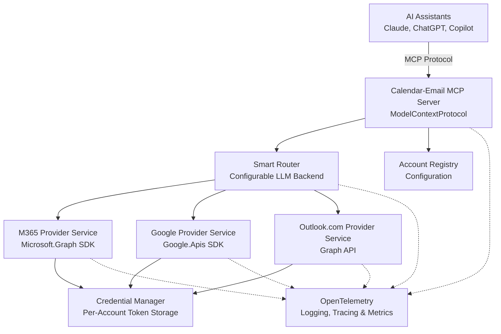

# Architecture

## High-Level Architecture



**Important**: While we have three *provider services* (M365, Google, Outlook.com), each *account* is a unique entity with its own authentication tokens. For example:
- Two M365 accounts (different tenants) = same provider service, different token caches
- M365 account + Outlook.com account = different provider services, different token caches
- Two Google accounts (different users) = same provider service, different token caches

**Provider ≠ Account**: A provider service can manage multiple accounts, each with isolated credentials.

## Core Components

### 1. MCP Server Interface

Built on the official .NET ModelContextProtocol package:

- **Exposes MCP tools** to AI assistants for unified email/calendar queries
- **Transport**: Supports stdio (primary), SSE, and WebSocket transports
- **Configuration**: Account setup and router configuration via JSON config files and MCP resources

See [MCP Tools](mcp-tools.md) for detailed tool definitions.

### 2. Account Registry

Configuration-based mapping of accounts to providers and credentials:

- Supports multiple M365 tenants, Outlook.com, and Google Workspace accounts
- Account metadata:
  - Unique account ID
  - Provider type (microsoft365, outlook.com, google)
  - Display name for user reference
  - Email domains for smart routing
  - Priority for ambiguous routing decisions
  - Provider-specific configuration (tenant ID, client ID, etc.)
- Persisted in JSON configuration files
- Validates account configuration on startup
- Provides account lookup by ID, domain, or criteria

See [Configuration](configuration.md) for examples.

### 3. Smart Router

Routes requests to appropriate provider service and account:

- **Configurable AI Backend** - Key Design Principle
- Uses LLM for intelligent account selection when not explicitly specified
- Supports multiple backend options:
  - Local models via Ollama (Phi-3.5-mini, Qwen2-7B, etc.)
  - Cloud APIs (OpenAI, Anthropic, Azure OpenAI)
  - Custom model endpoints

See [Routing](routing.md) for detailed routing logic.

### 4. Provider Services

**Key Principle**: One provider service instance manages multiple accounts of that provider type, with strict per-account token isolation.

- **IM365ProviderService**: Microsoft Graph API integration
- **IGoogleProviderService**: Google Workspace API integration
- **IOutlookComProviderService**: Microsoft Graph API for personal accounts
- **Provider Service Factory**: Resolves correct provider based on account type

See [Providers](providers.md) for implementation details.

### 5. Credential Manager

Manages per-account token storage and lifecycle:

- **Critical Design Principle**: Token storage is **PER-ACCOUNT**, not per-provider
- Separate authentication instances per account
- Isolated token caches prevent cross-account contamination
- Automatic token refresh per account

See [Authentication](authentication.md) for complete details.

### 6. Workflow Engine

Aggregates data from multiple accounts:

- Examples:
  - "Summarize all my unread emails from the last 24 hours"
  - "Show me my calendar for tomorrow across all accounts"
  - "Find 1-hour slots next week where I'm free across all calendars"
  - "What emails do I have about the Acme project?"
- Orchestrates multiple provider service calls in parallel
- Merges and deduplicates results from different sources

See [MCP Tools](mcp-tools.md) for workflow patterns.

### 7. OpenTelemetry Integration

Comprehensive observability across all components:

- **Structured Logging**: Consistent log formatting
- **Distributed Tracing**: End-to-end request tracking
- **Metrics Collection**: Performance monitoring and usage analytics
- **Multiple Exporters**: Console, OTLP, Jaeger, Prometheus, Azure Monitor

See [Telemetry](telemetry.md) for configuration and key metrics.

## Technical Stack

- **Language**: C# / .NET 9+ (target .NET 10 when available)
- **MCP Server Framework**: ModelContextProtocol NuGet package (official .NET implementation)
- **Provider SDKs**:
  - **Microsoft.Graph** (v5.x) - M365 and Outlook.com
  - **Microsoft.Identity.Client** - MSAL authentication
  - **Google.Apis.Gmail.v1** - Gmail API
  - **Google.Apis.Calendar.v3** - Google Calendar API
  - **Google.Apis.Auth** - Google OAuth 2.0
- **AI Routing**: Configurable LLM backend
  - Local: Ollama (Phi-3.5-mini, Qwen2-7B, etc.)
  - Cloud: OpenAI, Anthropic, Azure OpenAI
  - Custom: Any OpenAI-compatible endpoint
- **Dependency Injection**: Microsoft.Extensions.DependencyInjection
- **Configuration**: Microsoft.Extensions.Configuration (JSON + environment variables)
- **Logging**: Microsoft.Extensions.Logging
- **Authentication**: OAuth 2.0 with provider-specific implementations
  - Microsoft: MSAL with encrypted token cache
  - Google: GoogleWebAuthorizationBroker with FileDataStore
- **Observability**: OpenTelemetry for comprehensive telemetry
  - OpenTelemetry .NET SDK
  - ASP.NET Core instrumentation
  - Instrumentation for HTTP, custom spans, and metrics
- **Async/Parallel**: Native .NET async/await with Task.WhenAll for multi-account aggregation

## SDK Dependencies & Implementation Strategy

### Validated Through Spikes

All three provider integrations have been validated through working spike projects in `spikes/`:

#### Microsoft 365 (M365DirectAccess spike)
- **SDK**: Microsoft.Graph (v5.68.0+), Microsoft.Identity.Client (v4.66.2+)
- **Status**: ✅ Fully validated with multi-tenant support
- **Authentication**: MSAL with encrypted token cache per tenant
- **Key Findings**:
  - Native multi-tenant support using separate MSAL app per tenant
  - Encrypted token cache via MsalCacheHelper (DPAPI on Windows, Keychain on macOS)
  - Works with both work accounts and personal Microsoft accounts
  - No external process dependencies
- **Pattern**: `MultiTenantAuthenticator` manages multiple `IPublicClientApplication` instances

#### Google Workspace (GoogleWorkspace spike)
- **SDK**: Google.Apis.Gmail.v1, Google.Apis.Calendar.v3, Google.Apis.Auth
- **Status**: ✅ Fully validated with Gmail and Calendar operations
- **Authentication**: OAuth 2.0 via GoogleWebAuthorizationBroker with FileDataStore
- **Key Findings**:
  - Complete Gmail and Calendar API coverage
  - Separate credential storage per user via FileDataStore
  - Browser-based OAuth flow for initial authentication
  - No external dependencies beyond Google SDKs
  - Token refresh automatic
- **Pattern**: `GoogleAuthenticator` → separate `GmailService` and `GoogleCalendarService` instances

#### Outlook.com Personal (OutlookComPersonal spike)
- **SDK**: Microsoft.Graph (same as M365), Microsoft.Identity.Client
- **Status**: ✅ Validated for personal Microsoft accounts
- **Authentication**: MSAL with 'common' tenant for MSA support
- **Key Findings**:
  - Uses same Graph API as M365 but with different auth flow
  - Requires 'common' tenant instead of organization-specific tenant ID
  - Same token cache approach as M365
- **Pattern**: Nearly identical to M365, just different tenant configuration

### Implementation Strategy

Based on spike findings, Calendar-MCP will:

1. **Use Direct SDK Integration** - No external MCP servers or Node.js processes
   - Simpler architecture
   - Better performance
   - Easier debugging and maintenance
   - Consistent with proven spike patterns

2. **Dependency Injection Pattern**:
   ```csharp
   services.AddSingleton<IM365ProviderService, M365ProviderService>();
   services.AddSingleton<IGoogleProviderService, GoogleProviderService>();
   services.AddSingleton<IOutlookComProviderService, OutlookComProviderService>();
   services.AddSingleton<IProviderServiceFactory, ProviderServiceFactory>();
   ```

3. **Multi-Account Management**:
   - Account registry loads from configuration
   - Each provider service maintains dictionary of authentication instances by accountId
   - Provider service factory routes to correct provider based on account type
   - Account ID passed to all provider service methods
   - Provider looks up correct auth instance for that account
   - API calls always include accountId to ensure correct token usage

4. **Authentication Flow** (Per-Account):
   - **First run**: Interactive OAuth **per account** (browser-based)
   - **Subsequent runs**: Silent token acquisition from cache
   - **Token refresh**: Automatic via MSAL/Google SDK
   - **Token expiry**: Provider services handle refresh transparently
   - **Multi-account**: Each account authenticates independently
   - **Isolation**: Account A's authentication failure doesn't affect Account B

5. **Unified Data Models**:
   - Abstract provider differences behind common interfaces
   - `IEmailMessage`, `ICalendarEvent`, `IAccount` interfaces
   - Provider services return unified models
   - MCP tools work with unified models only

## Key Design Principles

1. **Per-Account Isolation**: Every account has its own authentication context and token storage
2. **Provider Independence**: Unified interfaces abstract provider-specific details
3. **Configurable AI**: Users choose their routing backend (local vs cloud)
4. **Observability First**: Comprehensive telemetry built-in from day one
5. **Security by Design**: Encrypted token storage, minimal privilege scopes
6. **Parallel Aggregation**: Multi-account queries execute concurrently
7. **Proven Patterns**: Implementation based on validated spike projects
