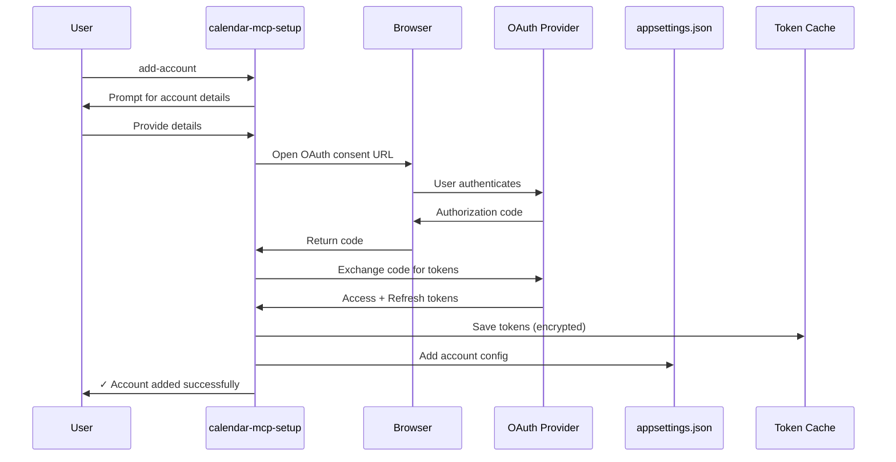

# Account Onboarding

## Overview

Calendar-MCP requires initial OAuth authentication for each account. Since MCP servers run in non-interactive contexts, we provide a separate CLI tool for account setup.

## Prerequisites: App Registration Setup

**BEFORE using calendar-mcp-setup, you must create app registrations:**

### Microsoft 365 / Outlook.com

You can choose between **shared** or **per-tenant** app registrations:

#### Option A: Shared App Registration (Recommended)

Create **one multi-tenant app registration** to use across all M365 tenants:

1. Go to [Azure Portal](https://portal.azure.com) → Azure Active Directory → App registrations
2. Click "New registration"
3. Name: "Calendar-MCP" (or your choice)
4. Supported account types: **"Accounts in any organizational directory (Any Azure AD directory - Multitenant)"**
5. Redirect URI: "Public client/native" → `http://localhost`
6. Register
7. Copy the **Application (client) ID** - you'll use this ClientId for ALL M365 tenants
8. Go to "API permissions" → Add permissions:
   - Microsoft Graph → Delegated permissions:
     - `Mail.Read`
     - `Mail.Send`
     - `Calendars.ReadWrite`
   - Click "Grant admin consent" (if you have permissions)
9. **Important**: Each tenant admin must consent when their users first authenticate

**Pros**: Simple, one ClientId for all tenants, fewer registrations to manage
**Cons**: Requires each tenant admin to allow external apps

#### Option B: Per-Tenant App Registration

Create **separate app registration in each tenant's Azure AD**:

1. Repeat above steps IN EACH tenant's Azure Portal
2. Supported account types: **"Accounts in this organizational directory only"**
3. Each tenant gets its own unique ClientId
4. Admin consent is automatic (internal app)

**Pros**: Works when tenant IT policies block external apps, more control per tenant
**Cons**: More setup work, multiple ClientIds to manage

#### Outlook.com (Personal Accounts)

Create one app registration for personal accounts:

1. Follow same steps as Option A
2. Supported account types: **"Personal Microsoft accounts only"**
3. Use this ClientId for all Outlook.com accounts

### Google Workspace / Gmail

You can choose between **shared** or **per-organization** OAuth clients:

#### Option A: Shared OAuth Client (Recommended)

Create **one OAuth client** to use across all Google accounts:

1. Go to [Google Cloud Console](https://console.cloud.google.com)
2. Create new project (or use existing)
3. Enable APIs: Gmail API, Google Calendar API
4. Go to "Credentials" → Create credentials → OAuth client ID
5. Application type: "Desktop app"
6. Name: "Calendar-MCP"
7. Copy **Client ID** and **Client Secret** - you'll use these for ALL Google accounts
8. Go to "OAuth consent screen" → Add scopes:
   - `gmail.readonly`
   - `gmail.send`
   - `calendar`

**Pros**: Simple, one set of credentials for all accounts, works for personal and most Workspace accounts
**Cons**: May not work if Workspace admin restricts external OAuth apps

#### Option B: Per-Organization OAuth Client

Create **separate OAuth client per Workspace organization**:

1. Each organization creates their own Google Cloud project
2. Follow above steps in each organization's project
3. Each organization gets its own ClientId/ClientSecret

**Pros**: Works when Workspace admins enforce OAuth restrictions, more control per org
**Cons**: More setup work, multiple credentials to manage

## calendar-mcp-setup CLI Tool

### Installation

```bash
# Install globally
dotnet tool install -g calendar-mcp-setup

# Or run from source
cd tools/calendar-mcp-setup
dotnet run
```

### Commands

#### Add Account

```bash
calendar-mcp-setup add-account

# Interactive prompts:
# 1. Account type? (microsoft365 / google / outlook.com)
# 2. Account ID (unique identifier, e.g., "xebia-work")
# 3. Display name (e.g., "Xebia Work Account")
# 4. Priority (default: 999)
# 5. Email domains for routing (e.g., "xebia.com,lhotka.net")
# 
# For Microsoft 365:
#   6. Tenant ID
#   7. Client ID
#   8. Scopes (default: Mail.Read,Mail.Send,Calendars.ReadWrite)
#
# For Google:
#   6. Client ID
#   7. Client Secret
#   8. User Email
#   9. Scopes (default: gmail.readonly,gmail.send,calendar)
#
# For Outlook.com:
#   6. Client ID
#   7. Scopes (default: Mail.Read,Mail.Send,Calendars.ReadWrite)
#
# → Opens browser for OAuth authentication
# → Saves token to credential store
# → Adds account to appsettings.json
```

#### List Accounts

```bash
calendar-mcp-setup list-accounts

# Output:
# Configured accounts:
# 
# ID              Display Name           Provider       Enabled  Domains
# xebia-work      Xebia Work Account     microsoft365   Yes      xebia.com
# marimer-work    Marimer Consulting     microsoft365   Yes      marimer.com, lhotka.net
# rocky-gmail     Personal Gmail         google         Yes      gmail.com
# rocky-outlook   Personal Outlook       outlook.com    Yes      outlook.com, hotmail.com
```

#### Test Account

```bash
calendar-mcp-setup test-account xebia-work

# Output:
# Testing account: xebia-work
# ✓ Configuration valid
# ✓ Token cache found
# ✓ Token valid (expires in 45 minutes)
# ✓ API call successful (retrieved 5 recent emails)
# 
# Account is ready to use!
```

#### Refresh Account

```bash
calendar-mcp-setup refresh-account xebia-work

# Output:
# Refreshing account: xebia-work
# → Opening browser for re-authentication...
# ✓ Authentication successful
# ✓ Token saved
# 
# Account refreshed successfully!
```

#### Remove Account

```bash
calendar-mcp-setup remove-account xebia-work

# Confirmation prompt:
# Are you sure you want to remove account 'xebia-work'? (y/N): y
# 
# ✓ Token cache deleted
# ✓ Configuration removed
# 
# Account removed successfully!
```

## Onboarding Flow



## Configuration Storage

### Account Metadata

Stored in `appsettings.json`:

```json
{
  "accounts": [
    {
      "id": "xebia-work",
      "displayName": "Xebia Work Account",
      "provider": "microsoft365",
      "enabled": true,
      "priority": 1,
      "domains": ["xebia.com"],
      "configuration": {
        "tenantId": "12345678-1234-1234-1234-123456789abc",
        "clientId": "87654321-4321-4321-4321-cba987654321",
        "scopes": ["Mail.Read", "Mail.Send", "Calendars.ReadWrite"]
      }
    }
  ]
}
```

### Credentials/Tokens

**Separate from configuration files!**

- **Microsoft**: `%LOCALAPPDATA%/CalendarMcp/msal_cache_{accountId}.bin` (encrypted)
- **Google**: `~/.credentials/calendar-mcp/{accountId}/` (JSON files)

See [Authentication](authentication.md#per-account-token-storage) for details.

## MCP Server Startup Behavior

1. Load account registry from `appsettings.json`
2. For each enabled account:
   - Initialize provider service
   - Create auth instance (IPublicClientApplication or UserCredential)
   - Attempt silent token acquisition from cache
   - If successful: Account ready
   - If token refresh fails: Log error, disable account, notify user
3. Expose MCP tools only for accounts with valid authentication
4. If no accounts valid: Return helpful error to AI assistant

**Example startup log**:
```
[INFO] Loading account registry...
[INFO] Found 4 configured accounts
[INFO] Initializing account: xebia-work (microsoft365)
[INFO]   ✓ Token cache found, valid until 2025-12-04 15:30:00
[INFO] Initializing account: marimer-work (microsoft365)
[WARN]   ⚠ Token expired, attempting refresh...
[INFO]   ✓ Token refreshed successfully
[INFO] Initializing account: rocky-gmail (google)
[ERROR]  ✗ Token refresh failed: Invalid grant
[ERROR]  → Run 'calendar-mcp-setup refresh-account rocky-gmail' to re-authenticate
[INFO] Initializing account: rocky-outlook (outlook.com)
[INFO]   ✓ Token cache found, valid until 2025-12-04 16:00:00
[INFO] MCP Server ready with 3 active accounts (1 failed)
```

## Troubleshooting

### "Token refresh failed: Invalid grant"

**Cause**: Refresh token expired or revoked

**Solution**:
```bash
calendar-mcp-setup refresh-account <account-id>
```

### "Account not found in configuration"

**Cause**: Account not added to appsettings.json

**Solution**:
```bash
calendar-mcp-setup add-account
```

### "Browser won't open for OAuth"

**Cause**: No browser available (e.g., SSH session)

**Solution**: Use device code flow (future enhancement) or run CLI on machine with browser

### "Insufficient permissions"

**Cause**: Required scopes not granted during OAuth consent

**Solution**:
1. Remove account: `calendar-mcp-setup remove-account <account-id>`
2. Re-add with correct scopes: `calendar-mcp-setup add-account`
3. Ensure all required permissions granted in consent screen

## Security Best Practices

1. **Run CLI as your user**: Never run as administrator/root
2. **Verify redirect URI**: Ensure OAuth redirects to `http://localhost` only
3. **Protect token caches**: File permissions automatically restrict to current user
4. **Revoke access**: Use provider admin console to revoke tokens if compromised
5. **Regular refresh**: Test accounts periodically with `test-account` command

## Future Enhancements

### MCP Resource for Onboarding

Potential enhancement: Expose onboarding instructions as MCP resource for AI assistant to guide user:

```typescript
// MCP resource: mcp://calendar-mcp/onboarding-instructions
{
  "instructions": [
    "Run: calendar-mcp-setup add-account",
    "Follow interactive prompts",
    "Authenticate in browser when prompted",
    "Repeat for each account"
  ]
}
```

AI assistant can surface this when users try to use the MCP server without configured accounts.
