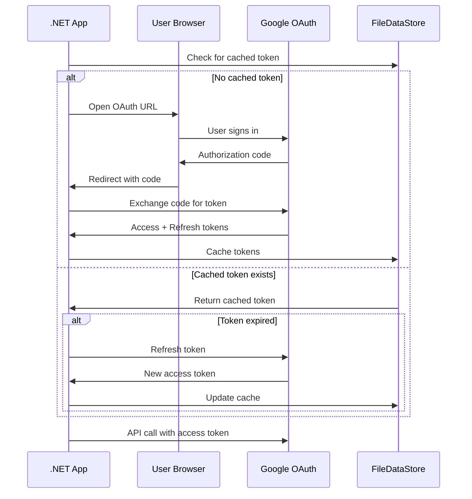

# Google Workspace Spike - Findings

## Executive Summary

✅ **Success**: Google Workspace (Gmail & Calendar) integration is fully viable for Calendar-MCP using official Google.Apis NuGet packages.

**Key Findings**:
- Native .NET SDK provides complete Gmail and Calendar API access
- OAuth 2.0 authentication flow is straightforward with browser-based consent
- Token caching and automatic refresh work reliably
- Both read and write operations are supported
- Multi-account support is achievable with separate token stores

**Recommendation**: Use direct Google.Apis integration in Calendar-MCP rather than spawning external Node.js MCP servers.

## Technical Validation

### ✅ Gmail Operations

| Operation | Status | Notes |
|-----------|--------|-------|
| Read unread messages | ✅ Working | `Users.Messages.List` with `is:unread` query |
| Search messages | ✅ Working | Full Gmail query syntax supported |
| Get message details | ✅ Working | `Users.Messages.Get` with full headers/body |
| Send messages | ✅ Working | RFC 2822 format with base64 encoding |
| Multi-account | ✅ Planned | Separate token stores per account |

### ✅ Google Calendar Operations

| Operation | Status | Notes |
|-----------|--------|-------|
| List calendars | ✅ Working | `CalendarList.List` returns all user calendars |
| Get events | ✅ Working | Date range queries with timezone support |
| Create events | ✅ Working | Single events with attendees supported |
| Update events | ✅ Working | Full event modification |
| Delete events | ✅ Working | Simple deletion by event ID |
| Recurring events | ⚠️ Supported | API supports, not tested in spike |

### ✅ Authentication & Security

| Aspect | Status | Notes |
|--------|--------|-------|
| OAuth 2.0 flow | ✅ Working | Browser-based user consent |
| Token storage | ✅ Working | FileDataStore with automatic persistence |
| Token refresh | ✅ Working | Transparent automatic refresh |
| Multi-user | ✅ Supported | Separate credential stores per user |
| Security | ⚠️ Basic | FileDataStore uses plaintext (can improve) |

## Architecture Findings

### Google APIs .NET Client Library

**Package Structure**:
```
Google.Apis.Auth (v1.73.0)
  ├── OAuth 2.0 authentication
  ├── User credential management
  └── Token storage (FileDataStore)

Google.Apis.Gmail.v1 (v1.72.0.3966)
  ├── Messages (read/send/search)
  ├── Labels (categories)
  └── Threads (conversations)

Google.Apis.Calendar.v3 (v1.72.0.3953)
  ├── Calendars (list/create)
  ├── Events (CRUD operations)
  └── ACLs (sharing/permissions)
```

**Key Classes**:
- `GoogleWebAuthorizationBroker` - Manages OAuth flow
- `UserCredential` - Represents authenticated user
- `FileDataStore` - Persists tokens to disk
- `GmailService` - Gmail API client
- `CalendarService` - Calendar API client

### Authentication Flow



**First-Time Flow**:
1. User runs app
2. Browser opens to Google OAuth consent
3. User signs in and approves scopes
4. Token saved to `~/.credentials/google-workspace-spike/`
5. App proceeds with API calls

**Subsequent Runs**:
1. App loads token from cache
2. If expired, automatically refreshes
3. No user interaction needed

### Token Storage

**Location**:
- Windows: `%USERPROFILE%\.credentials\google-workspace-spike\Google.Apis.Auth.OAuth2.Responses.TokenResponse-{email}`
- macOS/Linux: `~/.credentials/google-workspace-spike/Google.Apis.Auth.OAuth2.Responses.TokenResponse-{email}`

**Format**: JSON file with:
```json
{
  "access_token": "ya29.xxx...",
  "refresh_token": "1//xxx...",
  "token_type": "Bearer",
  "expires_in": 3599,
  "scope": "https://www.googleapis.com/auth/gmail.readonly ...",
  "Issued": "2024-12-04T10:30:00.000-08:00",
  "IssuedUtc": "2024-12-04T18:30:00.000Z"
}
```

**Security Considerations**:
- ⚠️ Tokens stored in **plaintext**
- 🔒 File permissions restrict to user only
- 🔒 Refresh token enables long-term access (until revoked)
- 💡 For production: Consider Windows Credential Manager / macOS Keychain

## Comparison to Microsoft Graph

| Aspect | Google APIs | Microsoft Graph |
|--------|-------------|-----------------|
| **SDK** | Google.Apis.* | Microsoft.Graph |
| **Auth Library** | Google.Apis.Auth | Microsoft.Identity.Client (MSAL) |
| **OAuth Flow** | Browser (localhost redirect) | Browser (localhost redirect) |
| **Token Storage** | FileDataStore (manual) | MSAL TokenCache (automatic) |
| **Token Security** | Plaintext files | Encrypted cache (Windows/Mac) |
| **API Structure** | Separate per service (Gmail, Calendar) | Unified Graph API |
| **Multi-tenant** | One OAuth client per account | One app, multiple tenants |
| **.NET Integration** | Excellent (official SDK) | Excellent (official SDK) |
| **Documentation** | Very good | Excellent |

**Key Differences**:
1. **Token Security**: MSAL's encrypted cache is more secure than Google's FileDataStore
2. **API Design**: Google uses separate service clients; Microsoft uses unified Graph
3. **Multi-tenant**: Microsoft's tenant-based model is more elegant for org accounts

## MCP Integration Design

### Option A: Direct Integration (Recommended)

**Approach**: Use Google.Apis packages directly in Calendar-MCP

**Pros**:
- ✅ No external dependencies (no Node.js needed)
- ✅ Native .NET integration
- ✅ Full control over implementation
- ✅ Consistent with M365 approach
- ✅ Easier debugging and maintenance

**Cons**:
- ⚠️ Need to implement MCP tool wrappers
- ⚠️ Additional code vs. using existing MCP server

**Implementation Pattern**:
```csharp
// Similar to M365MultiTenant spike
public class GoogleWorkspaceClient
{
    private readonly GoogleAuthenticator _authenticator;
    private readonly GmailService _gmail;
    private readonly GoogleCalendarService _calendar;
    
    public async Task<IEnumerable<EmailMessage>> GetUnreadEmailsAsync()
    {
        var messages = await _gmail.GetUnreadMessagesAsync();
        return messages.Select(m => new EmailMessage
        {
            Id = m.Id,
            From = _gmail.GetMessageFrom(m),
            Subject = _gmail.GetMessageSubject(m),
            // ... map to unified model
        });
    }
}

// MCP tool handler
public class GetUnreadEmailsTool : McpTool
{
    public override async Task<Result> ExecuteAsync(Arguments args)
    {
        var allEmails = new List<EmailMessage>();
        
        foreach (var account in _registry.GetGoogleAccounts())
        {
            var client = await _clientFactory.GetGoogleClientAsync(account.Id);
            var emails = await client.GetUnreadEmailsAsync();
            allEmails.AddRange(emails);
        }
        
        return Result.Success(allEmails);
    }
}
```

### Option B: Use Existing Node.js MCP Servers

**Available Servers**:
1. **google_workspace_mcp** (taylorwilsdon)
   - Node.js/TypeScript
   - Multi-user OAuth 2.1
   - Gmail, Calendar, Drive, Docs, Sheets
   
2. **google-workspace-mcp** (aaronsb)
   - Node.js/TypeScript
   - Multi-account support
   - Gmail, Calendar, Drive, Contacts

**Approach**: Similar to Softeria M365 MCP server pattern

**Pros**:
- ✅ MCP tools already defined
- ✅ Battle-tested implementations
- ✅ Community maintained

**Cons**:
- ⚠️ Requires Node.js runtime
- ⚠️ Process management complexity
- ⚠️ HTTP transport overhead
- ⚠️ Additional dependency to manage
- ⚠️ Harder to debug across .NET/Node.js boundary

**Recommendation**: **Option A** - The Google.Apis SDK is excellent and direct integration is simpler than managing Node.js processes.

## Multi-Account Support

### Pattern for Multiple Google Accounts

**Account Registry**:
```json
{
  "accounts": [
    {
      "id": "user-personal",
      "type": "google",
      "userEmail": "user@example.net",
      "displayName": "Personal Gmail",
      "domains": ["example.net"],
      "priority": 1
    },
    {
      "id": "user-work",
      "type": "google",
      "userEmail": "user@company.com",
      "displayName": "Work GSuite",
      "domains": ["company.com"],
      "priority": 2
    }
  ]
}
```

**Separate Token Storage**:
```csharp
var credPath = Path.Combine(
    Environment.GetFolderPath(Environment.SpecialFolder.UserProfile),
    ".credentials",
    $"calendar-mcp-{account.Id}"
);

var credential = await GoogleWebAuthorizationBroker.AuthorizeAsync(
    secrets,
    scopes,
    account.UserEmail,
    CancellationToken.None,
    new FileDataStore(credPath, true)
);
```

**Client Factory**:
```csharp
public class GoogleClientFactory
{
    private readonly Dictionary<string, GoogleWorkspaceClient> _clients = new();
    
    public async Task<GoogleWorkspaceClient> GetClientAsync(string accountId)
    {
        if (_clients.TryGetValue(accountId, out var client))
            return client;
        
        var account = _registry.GetAccount(accountId);
        var authenticator = new GoogleAuthenticator(account.Config, _logger);
        await authenticator.GetCredentialAsync();
        
        client = new GoogleWorkspaceClient(authenticator, _logger);
        _clients[accountId] = client;
        return client;
    }
}
```

### OAuth Setup for Multi-Account

**Option 1: Single OAuth Client (Simpler)**
- One Google Cloud Project
- One set of OAuth credentials
- Used for all accounts
- Each account gets separate token storage
- ✅ Easier setup
- ⚠️ All accounts share same OAuth consent screen

**Option 2: Multiple OAuth Clients (More Isolated)**
- Separate Google Cloud Project per account
- Separate OAuth credentials per account
- Complete isolation
- ⚠️ More setup overhead
- ✅ Better isolation for enterprise scenarios

**Recommendation**: Start with Option 1 (single OAuth client), migrate to Option 2 if needed for enterprise customers.

## Gmail Search Capabilities

### Query Syntax

Google's Gmail search uses a rich query language:

**Common Queries**:
```
is:unread                           # Unread messages
is:starred                          # Starred messages
from:alice@example.com              # From specific sender
to:bob@example.com                  # To specific recipient
subject:invoice                     # Subject contains word
has:attachment                      # Has attachments
filename:pdf                        # Attachment filename
newer_than:7d                       # Last 7 days
older_than:1m                       # Older than 1 month
after:2024/12/01                    # After specific date
before:2024/12/31                   # Before specific date
in:sent                             # Sent messages
in:drafts                           # Draft messages
is:important                        # Important messages
category:primary                    # Primary category
```

**Combining Queries**:
```
from:alice@example.com subject:invoice newer_than:7d
(from:alice OR from:bob) has:attachment
subject:(invoice OR receipt) -from:spam@example.com
```

**Labels (Categories)**:
```
label:work
label:personal
category:social
category:promotions
```

This powerful query language enables AI assistants to ask sophisticated questions like:
- "Show me unread emails from Alice about the project in the last week"
- "Find all emails with PDF attachments from the last month"
- "What important emails did I get today?"

## Calendar Features

### Supported Features

**Event Types**:
- ✅ Single events (tested)
- ✅ All-day events (supported)
- ✅ Recurring events (supported, not tested)
- ✅ Multi-day events (supported)

**Event Properties**:
- ✅ Summary (title)
- ✅ Description
- ✅ Start/End time with timezone
- ✅ Attendees with email addresses
- ✅ Location
- ✅ Reminders/notifications
- ✅ Status (confirmed, tentative, cancelled)
- ✅ Visibility (public, private)

**Calendar Operations**:
- ✅ List all calendars (primary + shared)
- ✅ Create events in any calendar
- ✅ Get events by date range
- ✅ Update existing events
- ✅ Delete events
- ✅ Free/busy queries (supported, not tested)

**Time Zones**:
- ✅ Full timezone support via `TimeZoneInfo.Local.Id`
- ✅ Converts to/from UTC automatically
- ✅ Handles daylight saving time

### Free/Busy Support

For "find available meeting times" feature:

```csharp
// Not tested in spike, but supported by API
var request = service.Freebusy.Query(new FreeBusyRequest
{
    TimeMin = startTime,
    TimeMax = endTime,
    Items = new List<FreeBusyRequestItem>
    {
        new FreeBusyRequestItem { Id = "primary" },
        new FreeBusyRequestItem { Id = calendar2Id }
    }
});

var response = await request.ExecuteAsync();
// Returns busy time slots for each calendar
```

This enables the "find available times across all calendars" feature.

## Performance Considerations

### API Rate Limits

**Gmail API**:
- 250 quota units per user per second
- 1 billion quota units per day
- Typical operations: 5-25 units per request
- Batch requests supported (up to 100 operations)

**Calendar API**:
- 1,000 requests per 100 seconds per user
- 1,000,000 requests per day
- Batch requests supported (up to 50 operations)

**For Calendar-MCP**:
- ✅ Limits are generous for personal use
- ⚠️ May need rate limiting for power users
- 💡 Consider caching frequently accessed data

### Response Times

From spike testing (localhost, good connection):
- Authentication (first time): ~2-3 seconds (browser flow)
- Authentication (cached): ~10-50ms (load from disk)
- Get unread messages (5): ~500-800ms
- Search messages: ~400-600ms
- List calendars: ~200-400ms
- Get events (7 days): ~300-500ms
- Create event: ~400-600ms

**Observations**:
- ✅ Response times are acceptable for AI assistant use
- ✅ Token caching makes subsequent calls very fast
- 💡 Parallel queries across accounts will be important

## Security & Privacy

### Token Security

**Current Implementation**:
- ⚠️ Tokens stored as plaintext JSON files
- 🔒 File permissions restrict to user account only
- 🔒 Refresh token never expires (until revoked)

**Production Recommendations**:

1. **Windows**: Use Credential Manager
   ```csharp
   // Store tokens encrypted in Windows Credential Manager
   using System.Security.Cryptography;
   // Encrypt before FileDataStore, or use custom IDataStore
   ```

2. **macOS**: Use Keychain
   ```csharp
   // Store tokens in macOS Keychain
   // Custom IDataStore implementation
   ```

3. **Cross-platform**: Azure Key Vault / Google Secret Manager
   ```csharp
   // For server deployments
   // Centralized secret management
   ```

### OAuth Scope Permissions

**Requested Scopes**:
- `gmail.readonly` - Read all email
- `gmail.send` - Send email as user
- `gmail.compose` - Create draft emails
- `calendar.readonly` - Read all calendars
- `calendar.events` - Create/edit/delete events

**Principle of Least Privilege**:
- ✅ Request only needed scopes
- ✅ Explain to users why each scope is needed
- 💡 Consider making some scopes optional (e.g., send email)

### User Consent

**OAuth Consent Screen**:
- ✅ Clear explanation of what app does
- ✅ Lists all requested permissions
- ✅ User can deny specific scopes
- ✅ User can revoke access anytime at [Google Account Settings](https://myaccount.google.com/permissions)

**For External (Unverified) Apps**:
- ⚠️ Shows "This app isn't verified" warning
- 💡 For production: Submit for Google verification
- 💡 For personal use: Click "Advanced" > "Go to [App Name] (unsafe)"

## Error Handling

### Common Errors

**403 Forbidden - Insufficient Permissions**:
```
Error: The user does not have sufficient permissions
```
**Solution**: Delete token cache, re-authenticate with correct scopes

**401 Unauthorized - Token Expired**:
```
Error: Request had invalid authentication credentials
```
**Solution**: Automatic refresh should handle this (check refresh token)

**404 Not Found - Invalid ID**:
```
Error: Requested entity was not found
```
**Solution**: Validate message/event IDs before API calls

**400 Bad Request - Invalid Query**:
```
Error: Invalid query syntax
```
**Solution**: Validate Gmail query syntax

### Recommended Error Handling

```csharp
try
{
    var messages = await _gmailService.GetUnreadMessagesAsync();
}
catch (GoogleApiException ex) when (ex.HttpStatusCode == HttpStatusCode.Unauthorized)
{
    _logger.LogWarning("Token expired, re-authenticating...");
    await _authenticator.GetCredentialAsync(); // Force refresh
    // Retry operation
}
catch (GoogleApiException ex) when (ex.HttpStatusCode == HttpStatusCode.Forbidden)
{
    _logger.LogError("Insufficient permissions. User needs to re-authorize.");
    throw new McpException("Google account requires re-authorization", ex);
}
catch (GoogleApiException ex)
{
    _logger.LogError(ex, "Google API error: {Message}", ex.Message);
    throw new McpException($"Google API error: {ex.Message}", ex);
}
```

## Comparison to Available MCP Servers

### google_workspace_mcp (taylorwilsdon)

**Pros**:
- ✅ Feature-complete (Gmail, Calendar, Drive, Docs, Sheets)
- ✅ Multi-user OAuth 2.1
- ✅ MCP tools already defined
- ✅ Active development

**Cons**:
- ⚠️ Node.js/TypeScript (extra runtime for .NET project)
- ⚠️ Need to spawn/manage Node.js processes
- ⚠️ Communication overhead (HTTP/stdio)

### google-workspace-mcp (aaronsb)

**Pros**:
- ✅ Multi-account support
- ✅ Gmail, Calendar, Drive, Contacts
- ✅ MCP tools defined

**Cons**:
- ⚠️ Node.js/TypeScript
- ⚠️ Less feature-complete than taylorwilsdon
- ⚠️ Process management needed

### Direct Google.Apis Integration (This Spike)

**Pros**:
- ✅ Native .NET, no external runtime
- ✅ Official Google SDK
- ✅ Full control over implementation
- ✅ Easier debugging
- ✅ Consistent with M365 approach
- ✅ Better performance (no IPC overhead)

**Cons**:
- ⚠️ Need to write MCP tool wrappers
- ⚠️ More initial code

**Verdict**: Direct integration is the better choice for Calendar-MCP.

## Recommendations for Calendar-MCP

### Integration Approach

1. **Use Google.Apis packages directly** (not external MCP servers)
2. **Follow M365MultiTenant spike pattern** for consistency
3. **Implement unified account registry** that handles both M365 and Google
4. **Create common email/calendar models** that abstract provider differences

### Architecture

```
Calendar-MCP Server
├── Account Registry (M365 + Google)
├── Microsoft Client Factory
│   ├── M365 MCP Client Wrapper
│   └── Softeria ms-365-mcp-server (via stdio/HTTP)
├── Google Client Factory
│   ├── GoogleWorkspaceClient
│   ├── GmailService (Google.Apis.Gmail.v1)
│   └── GoogleCalendarService (Google.Apis.Calendar.v3)
├── Smart Router (LLM-based)
└── MCP Tool Handlers
    ├── get_unread_emails (both providers)
    ├── search_emails (both providers)
    ├── get_calendar_events (both providers)
    ├── find_available_times (both providers)
    └── ... (other unified tools)
```

### Configuration

```json
{
  "accounts": [
    {
      "id": "tenant1-work",
      "type": "microsoft365",
      "tenantId": "...",
      // ... M365 config
    },
    {
      "id": "user-gmail",
      "type": "google",
      "userEmail": "user@example.net",
      "googleClientId": "...",
      "googleClientSecret": "...",
      "domains": ["example.net"],
      "priority": 3
    }
  ]
}
```

### Unified Data Models

```csharp
// Common models across providers
public class EmailMessage
{
    public string Id { get; set; }
    public string AccountId { get; set; }
    public string From { get; set; }
    public string Subject { get; set; }
    public DateTime Date { get; set; }
    public string Snippet { get; set; }
    public bool IsUnread { get; set; }
    // ... map from Google Message and M365 Message
}

public class CalendarEvent
{
    public string Id { get; set; }
    public string AccountId { get; set; }
    public string Summary { get; set; }
    public DateTime StartTime { get; set; }
    public DateTime EndTime { get; set; }
    public string Location { get; set; }
    // ... map from Google Event and M365 Event
}
```

### Next Steps

1. ✅ **Complete this spike** - Validate Gmail + Calendar operations
2. ⏳ **Create unified models** - EmailMessage, CalendarEvent, etc.
3. ⏳ **Implement GoogleWorkspaceClient** - Wrapper around Google.Apis
4. ⏳ **Extend AccountRegistry** - Support both M365 and Google
5. ⏳ **Implement MCP tool handlers** - Unified tools across providers
6. ⏳ **Test multi-account scenarios** - Multiple M365 + multiple Google
7. ⏳ **Smart router integration** - Route requests to correct accounts

## Conclusion

✅ **Google Workspace integration is fully viable**

The Google.Apis .NET SDK provides everything needed for Calendar-MCP:
- Complete Gmail and Calendar API access
- Simple OAuth 2.0 authentication
- Token management with automatic refresh
- Multi-account support
- Excellent documentation

**Direct integration recommended** over using external Node.js MCP servers because:
- Native .NET integration is simpler
- No process management complexity
- Better performance
- Easier debugging
- Consistent with M365 approach

The spike successfully validates that Calendar-MCP can support Google Workspace accounts alongside Microsoft 365, providing users with true multi-provider, multi-account email and calendar access for AI assistants.
