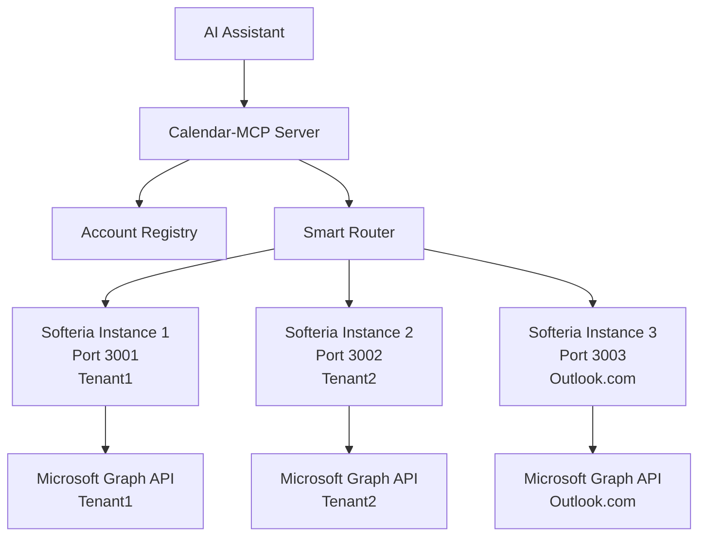

# M365 Multi-Tenant Spike - Initial Findings

## Discovery: Actual Microsoft MCP Servers

The original design document referenced `microsoft-mcp` by elyxlz, but **it does not exist as an npm package**. Through research, I identified three **real, working** Microsoft MCP server implementations:

## Available Microsoft MCP Servers

### 1. @softeria/ms-365-mcp-server ⭐ **RECOMMENDED**

**Repository**: https://github.com/Softeria/ms-365-mcp-server  
**Package**: `@softeria/ms-365-mcp-server` (published to npm)  
**Language**: TypeScript  
**Status**: ✅ Mature, actively maintained (v0.27.1, 357 stars)

#### Key Features:
- **90+ tools** covering email, calendar, OneDrive, Excel, OneNote, To-Do, Planner, contacts, Teams, SharePoint
- **Organization mode** for work/school accounts (`--org-mode` flag)
- **Multiple authentication methods**:
  - Device code flow (default, interactive)
  - OAuth authorization code flow (HTTP mode)
  - Bring Your Own Token (BYOT)
- **Token management**: Automatic caching and refresh
- **Output formats**: JSON (default) or TOON (30-60% token reduction)
- **Tool presets**: `--preset mail`, `--preset calendar`, etc.
- **HTTP transport** option for headless operation

#### Installation:
```bash
# Global install
npm install -g @softeria/ms-365-mcp-server

# Or use npx (no install needed)
npx @softeria/ms-365-mcp-server --org-mode
```

#### Multi-Tenant Support:
- ❌ Single tenant per instance
- ✅ Can run multiple instances on different ports for multi-tenant
- Configuration via environment variables:
  - `MS365_MCP_CLIENT_ID`
  - `MS365_MCP_CLIENT_SECRET`
  - `MS365_MCP_TENANT_ID`
  - `MS365_MCP_ORG_MODE`

#### Example Usage:
```bash
# For Tenant 1
MS365_MCP_CLIENT_ID=tenant1-client-id \
MS365_MCP_TENANT_ID=tenant1-tenant-id \
npx @softeria/ms-365-mcp-server --org-mode --http 3001

# For Tenant 2
MS365_MCP_CLIENT_ID=tenant2-client-id \
MS365_MCP_TENANT_ID=tenant2-tenant-id \
npx @softeria/ms-365-mcp-server --org-mode --http 3002
```

---

### 2. hvkshetry/office-365-mcp-server ✅ Good Alternative

**Repository**: https://github.com/hvkshetry/office-365-mcp-server  
**Package**: Not published to npm (clone from GitHub)  
**Language**: JavaScript (Node.js)  
**Status**: ✅ Functional, well-documented (7 stars)

#### Key Features:
- **Comprehensive M365 integration**: Email, calendar, Teams, OneDrive/SharePoint, contacts, planner
- **Headless operation**: Run without browser after initial auth
- **Automatic token management**: Persistent storage with auto-refresh
- **Email attachments**: Download embedded attachments, map SharePoint URLs
- **Advanced search**: Unified search with KQL support
- **Teams meetings**: Transcripts, recordings, AI insights
- **24 consolidated tools**

#### Installation:
```bash
git clone https://github.com/hvkshetry/office-365-mcp-server
cd office-365-mcp-server
npm install
```

#### Configuration:
Requires `.env` file:
```env
OFFICE_CLIENT_ID=your-client-id
OFFICE_CLIENT_SECRET=your-client-secret
OFFICE_TENANT_ID=common
OFFICE_REDIRECT_URI=http://localhost:3000/auth/callback
```

#### Multi-Tenant Support:
- ❌ Designed for single account per instance
- ✅ Can run multiple instances
- Requires separate authentication per tenant

#### Authentication:
Uses OAuth flow with local auth server on port 3000:
```bash
npm run auth-server
# Visit http://localhost:3000/auth
```

---

### 3. elyxlz/microsoft-mcp ⭐ Python Multi-Account

**Repository**: https://github.com/elyxlz/microsoft-mcp  
**Package**: Not published (clone from GitHub)  
**Language**: Python  
**Status**: ✅ Working, minimal but powerful (28 stars)

#### Key Features:
- **✅ Native multi-account support** - Built-in!
- All tools require `account_id` as first parameter
- **Tools**: Email, calendar, OneDrive files, contacts, unified search
- **Authentication**: Device code flow with token caching
- **Python-based**: Uses `uv` for dependency management

#### Installation:
```bash
git clone https://github.com/elyxlz/microsoft-mcp.git
cd microsoft-mcp
uv sync
```

#### Multi-Tenant Support:
- ✅ **Explicit multi-account support built-in**
- `list_accounts()` returns all authenticated accounts
- All tools accept `account_id` parameter
- Token cache: `~/.microsoft_mcp_token_cache.json`

#### Example Usage:
```python
# List all authenticated accounts
accounts = list_accounts()
# Returns: [{"account_id": "account1", ...}, {"account_id": "account2", ...}]

# Use specific account
account_id = accounts[0]["account_id"]
emails = list_emails(account_id, limit=10)
send_email(account_id, "to@example.com", "Subject", "Body")
```

#### Authentication:
```bash
export MICROSOFT_MCP_CLIENT_ID="your-client-id"
uv run authenticate.py
# Follow device code prompts for each account
```

---

## Comparison Matrix

| Feature | Softeria | hvkshetry | elyxlz |
|---------|----------|-----------|--------|
| **Language** | TypeScript | JavaScript | Python |
| **npm Package** | ✅ Published | ❌ Clone only | ❌ Clone only |
| **Multi-Account Built-in** | ❌ | ❌ | ✅ |
| **Multi-Instance Support** | ✅ | ✅ | N/A |
| **Number of Tools** | 90+ | 24 | ~20 |
| **Authentication** | Device/OAuth/BYOT | OAuth | Device code |
| **Teams Support** | ✅ | ✅ | ❌ |
| **SharePoint Support** | ✅ | ✅ | ❌ |
| **Maturity** | ⭐⭐⭐⭐⭐ | ⭐⭐⭐⭐ | ⭐⭐⭐ |
| **Documentation** | Excellent | Good | Minimal |
| **Active Development** | ✅ Very active | ⚠️ Moderate | ⚠️ Moderate |

---

## Recommendation for Calendar-MCP

### Primary Choice: **Softeria's @softeria/ms-365-mcp-server**

**Reasons:**
1. **Most mature and feature-complete** (90+ tools)
2. **Published to npm** - Easy installation and updates
3. **Active development** - Recent commits, responsive maintainer
4. **Flexible authentication** - Device code, OAuth, BYOT
5. **HTTP transport option** - Good for headless/service scenarios
6. **Tool presets** - Can reduce token overhead
7. **Excellent documentation** with many examples

**Multi-Tenant Strategy:**
- Run separate instances for each tenant on different ports
- Use HTTP transport mode (`--http <port>`)
- Configure via environment variables per instance
- Our orchestration layer manages multiple instances

### Alternative: **elyxlz's microsoft-mcp** (Python)

**Reasons:**
1. **Native multi-account support** - Perfect for our use case
2. **Simpler architecture** - One process handles all accounts
3. **Python-based** - May fit better with AI/ML tooling

**Considerations:**
- Less mature than Softeria
- Fewer features (no Teams, SharePoint)
- Python dependency may complicate C# integration
- Not published to package registry

---

## Next Steps for Spike

1. **Install Softeria's server**:
   ```bash
   npm install -g @softeria/ms-365-mcp-server
   ```

2. **Set up Azure AD app registrations** for both tenants
   - Create separate app registrations per tenant
   - Or use multi-tenant app registration with `tenant_id: common`

3. **Configure authentication**:
   - Test device code flow first (simplest)
   - Consider BYOT for production (external OAuth management)

4. **Run multi-instance test**:
   ```bash
   # Terminal 1 - Tenant1
   MS365_MCP_CLIENT_ID=$TENANT1_CLIENT_ID \
   MS365_MCP_TENANT_ID=$TENANT1_TENANT_ID \
   npx @softeria/ms-365-mcp-server --org-mode --http 3001
   
   # Terminal 2 - Tenant2
   MS365_MCP_CLIENT_ID=$TENANT2_CLIENT_ID \
   MS365_MCP_TENANT_ID=$TENANT2_TENANT_ID \
   npx @softeria/ms-365-mcp-server --org-mode --http 3002
   ```

5. **Test MCP protocol integration** from C#:
   - Use `@modelcontextprotocol/sdk` or HTTP client
   - Send tool calls to both instances
   - Aggregate results

6. **Document findings**:
   - Token refresh behavior
   - Performance characteristics
   - Rate limits encountered
   - Error handling patterns

---

## Questions to Answer Through Spike

1. **Authentication Flow**:
   - How does device code flow work in practice?
   - Can we use BYOT to centralize OAuth?
   - How are tokens stored and secured?

2. **Multi-Instance Management**:
   - Can both instances run simultaneously?
   - What's the startup time per instance?
   - How do we handle instance failures?

3. **Performance**:
   - What's the latency for calendar queries?
   - What's the latency for email queries?
   - How many concurrent requests can each instance handle?

4. **API Coverage**:
   - Do all Graph API features work as expected?
   - Any gaps in functionality?
   - Are there beta/preview APIs available?

5. **Integration Points**:
   - How do we communicate via MCP protocol from C#?
   - Can we use stdio transport from .NET?
   - Or should we use HTTP transport?

---

## Architecture Implications

Based on these findings, the calendar-mcp architecture should:

1. **MCP Client Manager** should:
   - Spawn and manage multiple MCP server processes
   - One process per tenant/account
   - Use HTTP transport for easier management
   - Handle process lifecycle (start, stop, restart)

2. **Account Registry** should:
   - Map account IDs to MCP server instances
   - Track server ports and health status
   - Handle authentication credentials per account

3. **Smart Router** should:
   - Route requests to appropriate MCP server instance
   - Handle parallel queries to multiple servers
   - Aggregate and deduplicate results

4. **Consider**:
   - Using Python elyxlz server for true multi-account support
   - Or building a Python wrapper around Softeria's server
   - Or implementing multi-account coordination in our orchestration layer

---

## Updated Design Recommendation



Each MCP server instance:
- Runs independently
- Handles its own authentication
- Communicates via HTTP transport
- Exposes MCP protocol endpoints

Calendar-MCP orchestrates:
- Instance management (start/stop)
- Request routing
- Result aggregation
- Error handling and retry
